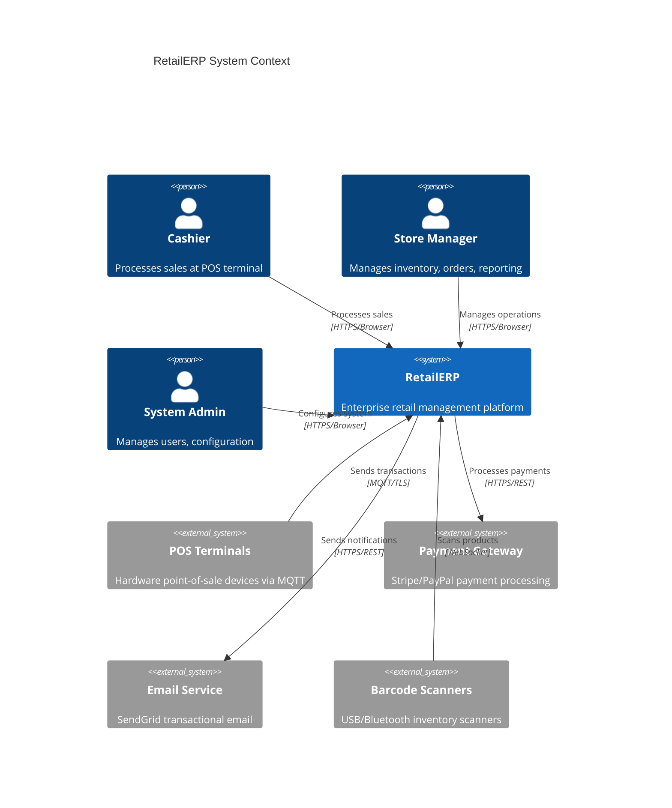
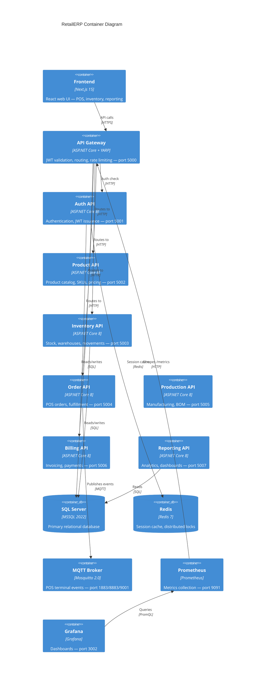
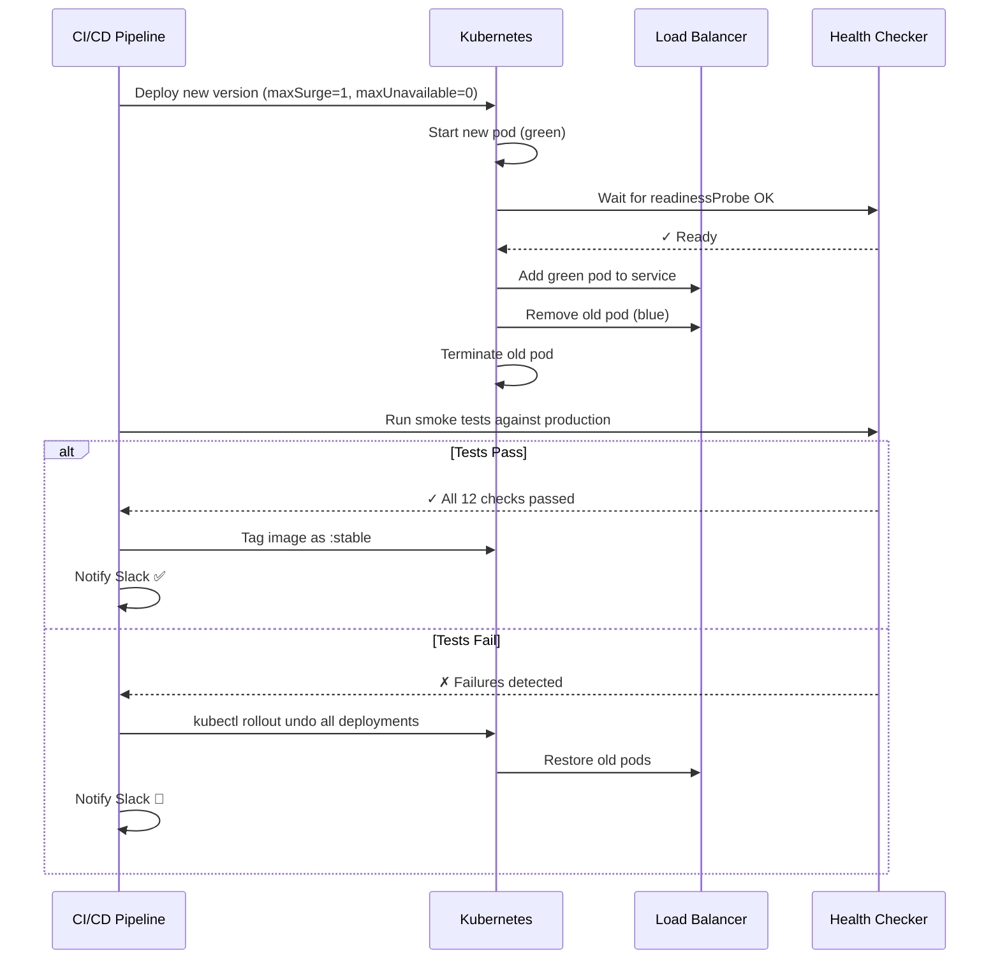
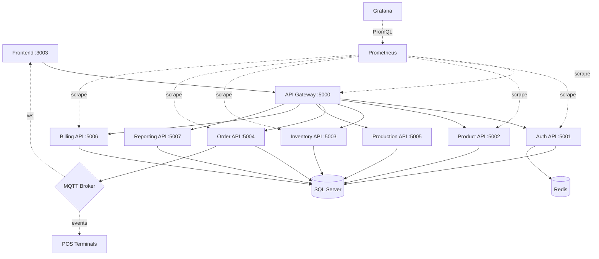
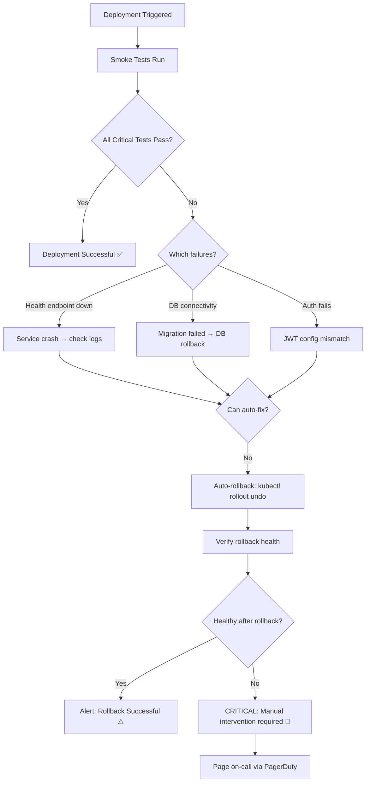
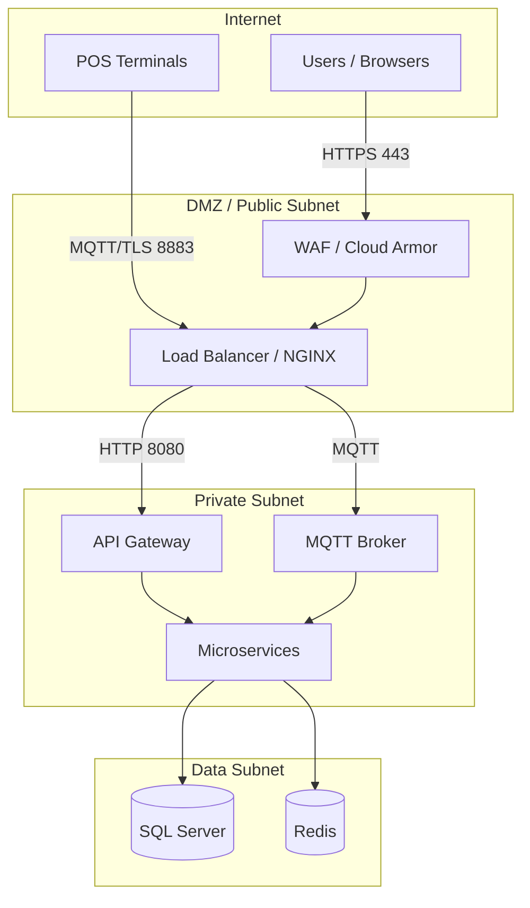

# RetailERP — One-Click Deployment Architecture

**Version:** 1.0.0 | **Date:** 2026-03-24 | **Status:** Active

---

## C4 Context Diagram



---

## C4 Container Diagram



---

## CI/CD Pipeline Flow

```mermaid
flowchart LR
  subgraph build["Build (Parallel)"]
    B1[Build Auth API] & B2[Build Product API] & B3[Build Inventory] &
    B4[Build Order API] & B5[Build Billing API] & B6[Build Gateway] & B7[Build Frontend]
  end

  subgraph scan["Security Scan"]
    S1[Trivy Container Scan]
    S2[CodeQL SAST]
    S3[Dependency Audit]
  end

  subgraph dev["Dev (Auto)"]
    D1[kubectl apply] --> D2[Wait for rollout] --> D3[Smoke Tests ✓]
  end

  subgraph qa["QA (Auto)"]
    Q1[kubectl apply] --> Q2[Smoke Tests ✓]
  end

  subgraph uat["UAT (Manual Approval)"]
    UA[👤 Reviewer Approval] --> U1[kubectl apply] --> U2[Smoke Tests ✓]
  end

  subgraph prod["Production (2 Reviewers + Timer)"]
    PA[👤👤 Approval + ⏱ Timer] --> P1[Rolling Deploy] --> P2[Smoke Tests]
    P2 -->|pass| P3[Tag as :stable]
    P2 -->|fail| P4[Auto Rollback 🔄]
  end

  build --> scan --> dev --> qa --> uat --> prod
```

---

## Zero-Downtime Blue/Green Strategy (Production)



---

## Service Dependency Map



---

## Rollback Decision Flowchart



---

## Network Topology


