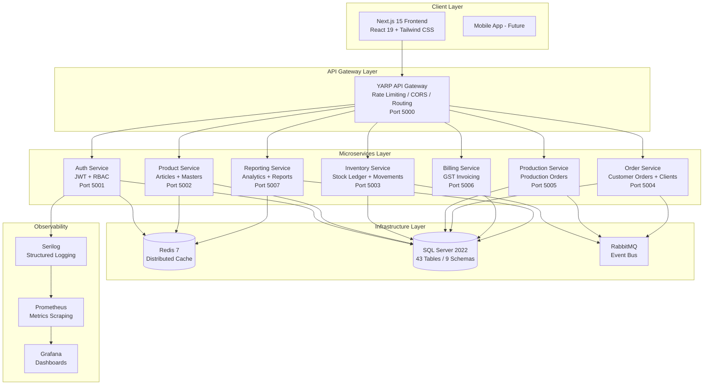
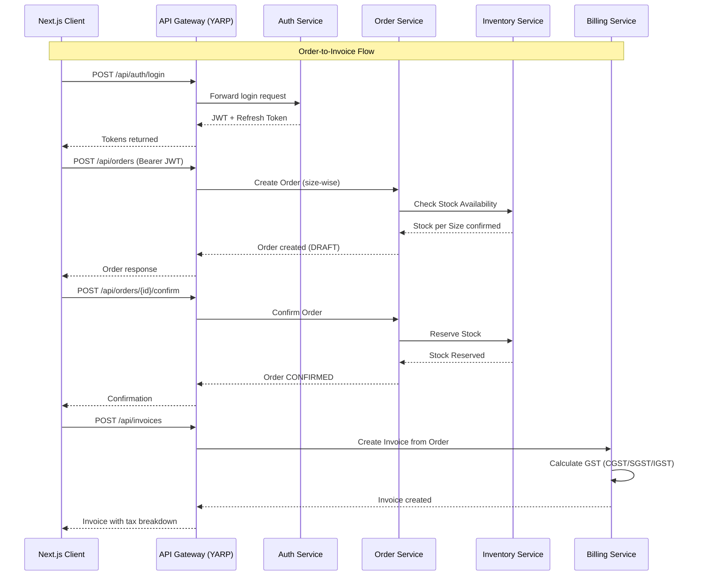
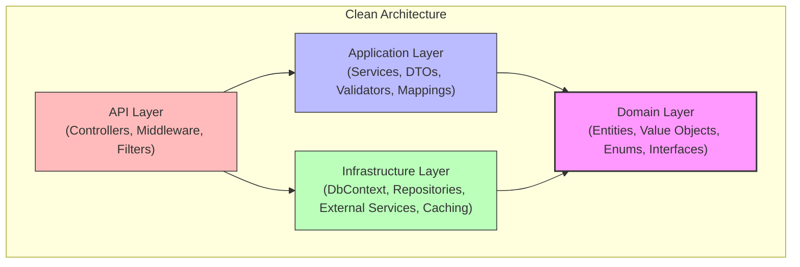
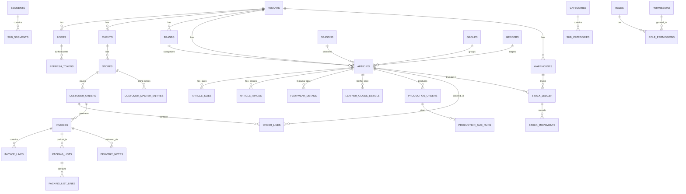
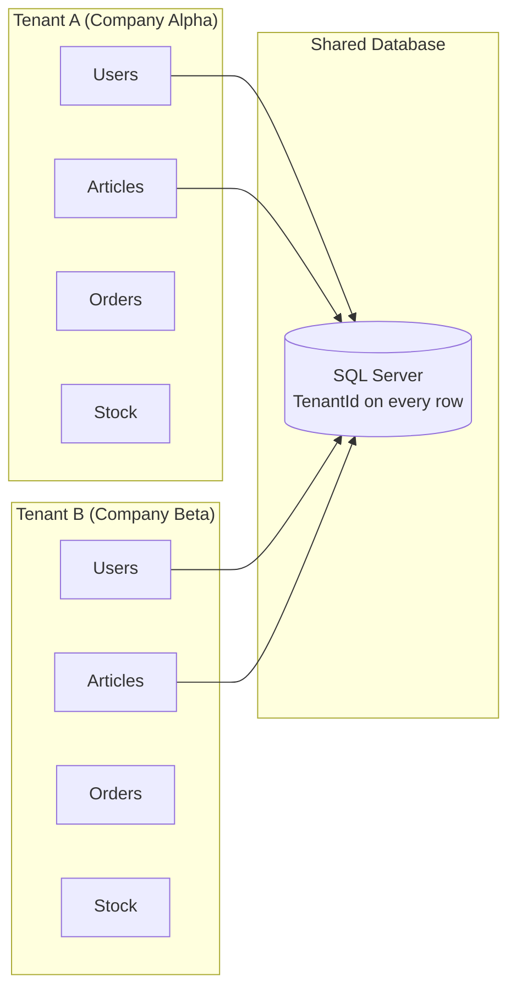
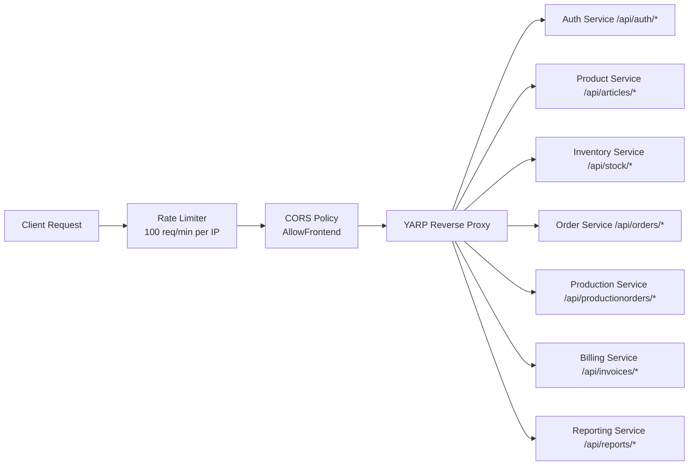
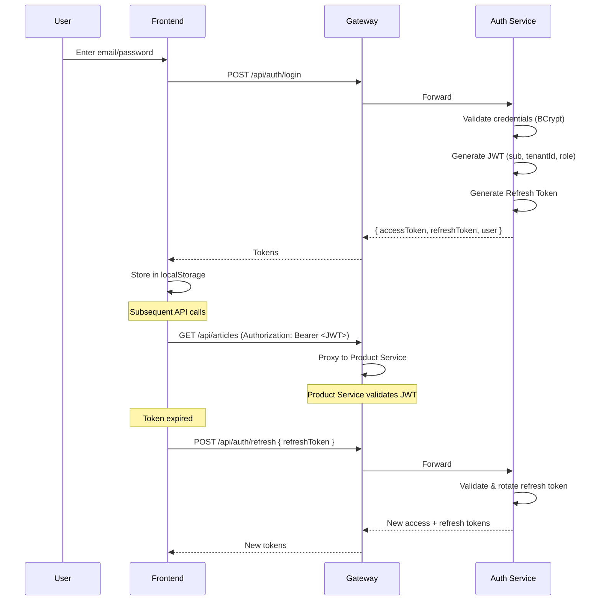

# RetailERP - System Architecture

## System Overview

**EL CURIO RetailERP** is a multi-tenant retail distribution platform for footwear, bags, and belts manufacturing and distribution. It manages inventory, billing, analytics, and warehouse operations from a single platform.

## High-Level Architecture



## Service Communication Flow



## Clean Architecture (Per Service)

Each microservice follows Clean Architecture with four layers:



### Directory Structure per Service

```
Service/
├── RetailERP.{Service}.Domain/           # Enterprise Business Rules
│   ├── Entities/                          # Domain entities
│   └── (no external dependencies)
├── RetailERP.{Service}.Application/      # Application Business Rules
│   ├── DTOs/                              # Data transfer objects
│   ├── Interfaces/                        # Service contracts
│   ├── Services/                          # Business logic
│   ├── Validators/                        # FluentValidation rules
│   └── Mappings/                          # Entity-to-DTO mappings
├── RetailERP.{Service}.Infrastructure/   # Frameworks & Drivers
│   ├── Data/
│   │   ├── Context/                       # EF Core DbContext
│   │   ├── Repositories/                  # Repository implementations
│   │   └── Configurations/                # EF entity configurations
│   ├── Services/                          # External service implementations
│   └── Caching/                           # Redis cache layer
└── RetailERP.{Service}.API/              # Interface Adapters
    ├── Controllers/                       # REST API controllers
    ├── Middleware/                         # Custom middleware
    ├── Filters/                           # Action/exception filters
    ├── Extensions/                        # DI registration extensions
    └── Program.cs                         # Application entry point
```

## Database Schema Architecture



## Multi-Tenant Architecture

Every entity in the system is scoped by `TenantId`:



**Tenant isolation is enforced at:**
1. **Database level** -- `TenantId` column and unique constraints per tenant
2. **API level** -- `TenantId` extracted from JWT claims on every request
3. **Query level** -- All queries filter by `TenantId`

## API Gateway Architecture

The YARP gateway provides:



Key features:
- **Rate limiting**: 100 requests per minute per IP (fixed window)
- **CORS**: Configured origins (frontend URLs)
- **No gateway-level auth**: Each service validates JWT independently
- **Health check**: `/health` endpoint
- **Metrics**: Prometheus `/metrics` endpoint

## Authentication & Authorization Flow



### JWT Claims Structure

| Claim | Description |
|-------|-------------|
| `sub` | User ID (GUID) |
| `tenantId` | Tenant ID (GUID) |
| `email` | User email |
| `tenantName` | Company name |
| `role` | User role (Admin, Manager, Warehouse, Sales, Accounts, Viewer) |

### RBAC Permission Matrix

| Permission | Admin | Manager | Warehouse | Sales | Accounts | Viewer |
|-----------|-------|---------|-----------|-------|----------|--------|
| Dashboard | View | View | View | View | View | View |
| Users | CRUD | View | - | - | - | - |
| Roles | CRUD | View | - | - | - | - |
| Articles | CRUD | CRUD | View | View | View | View |
| Stock | CRUD | CRUD | CRUD | View | View | View |
| Orders | CRUD | CRUD | View | CRUD | View | View |
| Invoices | CRUD | CRUD | View | View | CRUD | View |
| Reports | View | View | View | View | View | View |

## Technology Decisions

| Component | Technology | Rationale |
|-----------|-----------|-----------|
| Frontend | Next.js 15 + ShadCN | SSR-capable, App Router, enterprise UI components |
| Backend | ASP.NET Core 8 | High performance, enterprise support, mature ecosystem |
| Database | SQL Server 2022 | ACID compliance, stored procedures, enterprise features |
| Cache | Redis 7 | Distributed cache for multi-instance deployment |
| Gateway | YARP | .NET native reverse proxy, configuration-driven routing |
| Auth | JWT + RBAC | Stateless authentication, fine-grained permissions |
| Messaging | RabbitMQ | Asynchronous inter-service communication |
| Containers | Docker + K8s | Orchestration, scaling, self-healing |
| CI/CD | GitHub Actions | Native GitHub integration |
| Logging | Serilog | Structured logging, multiple sinks |
| Metrics | Prometheus + Grafana | Industry standard observability stack |
| State Mgmt | Zustand | Lightweight, TypeScript-first state management |

## Security Architecture

| Concern | Implementation |
|---------|---------------|
| Authentication | JWT tokens with refresh token rotation |
| Authorization | RBAC with per-module permission matrix (View/Add/Edit/Delete) |
| API Rate Limiting | 100 requests/min per IP via YARP gateway |
| Input Validation | FluentValidation on all API boundaries |
| SQL Injection | Entity Framework parameterized queries + Dapper parameterized queries |
| Audit Logging | `audit.AuditLog` table records all mutations with old/new values |
| Transport | HTTPS everywhere |
| CORS | Restricted to known frontend origins |
| Password Storage | BCrypt hashing |
| Token Storage | Access token in localStorage, refresh token with rotation |
| Tenant Isolation | TenantId on every row, enforced at query level |

## Design Patterns Used

| Pattern | Where |
|---------|-------|
| Clean Architecture | Every microservice (4 layers) |
| Repository Pattern | Infrastructure layer data access |
| Unit of Work | EF Core DbContext per request |
| CQRS (partial) | Reporting service uses Dapper for reads, EF Core for writes elsewhere |
| API Gateway | YARP reverse proxy as single entry point |
| Observer/Event Bus | RabbitMQ for inter-service events |
| Strategy Pattern | GST calculation (IGST vs CGST+SGST based on inter-state flag) |
| Factory Pattern | JWT token generation |
| Singleton | Redis cache connections, Serilog logger |
