# RetailERP - Frontend Components Documentation

## Overview

The frontend is a **Next.js 15** application using the **App Router**, built with **React 19**, **TypeScript**, **Tailwind CSS**, and **Zustand** for state management. It features 38 dashboard pages, a dark/light theme system with 5 color themes, and PWA support.

## Technology Stack

| Technology | Version | Purpose |
|-----------|---------|---------|
| Next.js | 15 | App Router, SSR/SSG framework |
| React | 19 | UI library |
| TypeScript | Latest | Type safety |
| Tailwind CSS | Latest | Utility-first CSS |
| Zustand | Latest | Lightweight state management |
| Axios | Latest | HTTP client with interceptors |
| Lucide React | Latest | Icon library |
| ShadCN UI | Custom | UI component patterns |

## Directory Structure

```
src/frontend/src/
├── app/                          # Next.js App Router
│   ├── page.tsx                  # Root redirect (/ -> /dashboard or /login)
│   ├── layout.tsx                # Root layout (HTML, fonts, globals)
│   ├── globals.css               # Global styles, theme variables, animations
│   ├── login/
│   │   └── page.tsx              # Login page (3D animated scene)
│   ├── setup/
│   │   └── page.tsx              # Initial tenant setup page
│   └── dashboard/
│       ├── layout.tsx            # Dashboard layout (sidebar + header + auth guard)
│       ├── page.tsx              # Main dashboard (stats, charts, activity)
│       ├── masters/              # Master data management (11 pages)
│       ├── customers/            # Client & store management (2 pages)
│       ├── inventory/            # Stock & warehouse operations (7 pages)
│       ├── orders/               # Order management (2 pages)
│       ├── production/           # Production orders (1 page)
│       ├── billing/              # Invoicing & packing (3 pages)
│       ├── reports/              # Analytics & reports (1 page, 9 tabs)
│       ├── warehouse/            # Warehouse management (1 page)
│       └── admin/                # Administration (5 pages)
├── components/
│   ├── layout/
│   │   ├── sidebar.tsx           # Collapsible sidebar with navigation tree
│   │   └── header.tsx            # Top header with breadcrumbs, search, theme
│   ├── ui/
│   │   ├── chart-card.tsx        # Chart container component
│   │   ├── data-table.tsx        # Reusable data table with sorting/pagination
│   │   ├── modal.tsx             # Modal dialog component
│   │   ├── skeleton.tsx          # Loading skeleton component
│   │   ├── status-badge.tsx      # Color-coded status badges
│   │   └── theme-switcher.tsx    # Dark/light mode + color theme selector
│   └── pwa/
│       └── service-worker-registrar.tsx  # PWA service worker registration
├── lib/
│   ├── api.ts                    # Axios instance with JWT interceptors
│   └── utils.ts                  # Utility functions (formatCurrency, formatDate, cn)
└── store/
    ├── auth-store.ts             # Authentication state (Zustand)
    └── theme-store.ts            # Theme state (Zustand)
```

## Page Inventory (38 Pages)

### Authentication & Setup

| Route | Page | Description |
|-------|------|-------------|
| `/` | Root | Redirects to `/dashboard` or `/login` based on auth state |
| `/login` | Login | Animated 3D login page with email/password |
| `/setup` | Setup | Initial tenant/company setup wizard |

### Dashboard

| Route | Page | Description |
|-------|------|-------------|
| `/dashboard` | Main Dashboard | KPI stats (6 cards), sales chart, inventory donut, production bars, activity timeline, recent orders table |

### Masters (11 pages)

| Route | Page | Description |
|-------|------|-------------|
| `/dashboard/masters/brands` | Brands | CRUD for product brands |
| `/dashboard/masters/genders` | Genders | CRUD for gender categories (Men, Women, Kids, Unisex) |
| `/dashboard/masters/seasons` | Seasons | CRUD for seasons with date ranges (SS24, AW24) |
| `/dashboard/masters/segments` | Segments | CRUD for product segments (Footwear, Leather Goods) |
| `/dashboard/masters/sub-segments` | Sub-Segments | CRUD for sub-segments linked to parent segments |
| `/dashboard/masters/categories` | Categories | CRUD for categories (Shoes, Bags, Belts) |
| `/dashboard/masters/sub-categories` | Sub-Categories | CRUD for sub-categories (Derby, Oxford, Loafer) |
| `/dashboard/masters/groups` | Groups | CRUD for design families/collections |
| `/dashboard/masters/sizes` | Sizes | Size chart management (Euro/UK/US/Indian conversion) |
| `/dashboard/masters/articles` | Articles | Full article management with filtering, images, footwear/leather details |
| `/dashboard/masters/skus` | SKUs | SKU (Stock Keeping Unit) management with size variants |

### Customers (2 pages)

| Route | Page | Description |
|-------|------|-------------|
| `/dashboard/customers/clients` | Clients | B2B client management with GSTIN, margin settings |
| `/dashboard/customers/stores` | Stores | Retail store management linked to clients |

### Inventory (7 pages)

| Route | Page | Description |
|-------|------|-------------|
| `/dashboard/inventory/stock` | Stock Overview | Stock ledger view with expandable size rows, warehouse filter, frozen stock indicator |
| `/dashboard/inventory/receipt` | Stock Receipt (GRN) | Goods Received Note entry with size-wise quantities |
| `/dashboard/inventory/dispatch` | Dispatch | Outward stock dispatch recording |
| `/dashboard/inventory/returns` | Returns | Customer return processing |
| `/dashboard/inventory/adjustment` | Stock Adjustment | Add/remove stock with approval workflow |
| `/dashboard/inventory/transactions` | Transactions | Full stock movement transaction history |
| `/dashboard/inventory/stock-freeze` | Stock Freeze | Freeze/unfreeze stock for period-end |

### Orders (2 pages)

| Route | Page | Description |
|-------|------|-------------|
| `/dashboard/orders` | Customer Orders | Size-wise order creation with article search, stock availability check, client/store selection |
| `/dashboard/orders/channels` | Sales Channels | Sales channel configuration (MBO, EBO, Distributor) |

### Production (1 page)

| Route | Page | Description |
|-------|------|-------------|
| `/dashboard/production` | Production Orders | Size-wise production order management with material details (last, upper leather, lining, sole), approval workflow, print support |

### Billing (3 pages)

| Route | Page | Description |
|-------|------|-------------|
| `/dashboard/billing/invoices` | Tax Invoices | GST-compliant invoice creation with auto tax calculation (CGST/SGST/IGST), print-ready format, barcode support |
| `/dashboard/billing/packing` | Packing Lists | Carton-wise packing list generation linked to invoices |
| `/dashboard/billing/delivery` | Delivery Notes | Delivery note management with receipt confirmation |

### Reports (1 page, 9 tabs)

| Route | Tab | Description |
|-------|-----|-------------|
| `/dashboard/reports` | Sales | Sales register/summary with date range, client filter |
| | Inventory | Stock levels, low-stock alerts, warehouse filter |
| | Production | Production order tracking by status and date |
| | Intent | Purchase intent analysis |
| | Consignment | Consignment stock tracking |
| | GST | GST compliance reports (CGST/SGST/IGST breakdown) |
| | Valuation | Stock valuation reports |
| | Invoice | Invoice register with tax details |
| | Packing | Packing list reports |

**Report Features:**
- Date range picker with shortcuts (Today, This Week, This Month, This Quarter, This Year)
- CSV export for all report types
- Print-friendly formatting
- Client/warehouse/status filters per report type
- Summary and detailed view modes

### Warehouse (1 page)

| Route | Page | Description |
|-------|------|-------------|
| `/dashboard/warehouse` | Warehouse Management | Warehouse listing and management |

### Administration (5 pages)

| Route | Page | Description |
|-------|------|-------------|
| `/dashboard/admin/users` | Users | User management (CRUD, role assignment) |
| `/dashboard/admin/roles` | Roles & Permissions | Role management with per-module permission matrix |
| `/dashboard/admin/audit` | Audit Log | System-wide audit trail viewer |
| `/dashboard/admin/company` | Company Master | Tenant/company profile settings |
| `/dashboard/admin/license` | License | License management and status |

## Component Library

### Layout Components

#### Sidebar (`components/layout/sidebar.tsx`)
- Collapsible sidebar with 260px expanded / 72px collapsed width
- Hierarchical navigation with expandable sections
- Active route highlighting with animated indicator bar
- Tooltip labels in collapsed mode
- Mobile responsive with overlay mode
- User avatar with initials and logout button
- Section headers: Masters, Inventory, Billing, Reports, Administration

#### Header (`components/layout/header.tsx`)
- Dynamic breadcrumbs based on current route
- Global search input
- Theme switcher toggle
- User menu
- Mobile sidebar toggle (hamburger)

### UI Components

#### DataTable (`components/ui/data-table.tsx`)
Reusable table component with:
- Column definitions with type-safe generics
- Server-side pagination
- Sortable columns
- Row click handlers
- Empty state handling
- Loading skeletons

#### Modal (`components/ui/modal.tsx`)
- Backdrop click to close
- Escape key support
- Customizable width
- Header with title and close button
- Animated entry/exit

#### StatusBadge (`components/ui/status-badge.tsx`)
Color-coded status indicators:
- Green: CONFIRMED, COMPLETED, DELIVERED, ACTIVE
- Blue: APPROVED, PROCESSING
- Amber: DRAFT, PENDING, IN_PRODUCTION
- Red: CANCELLED
- Gray: default/unknown

#### ChartCard (`components/ui/chart-card.tsx`)
Card container for charts with title and subtitle.

#### Skeleton (`components/ui/skeleton.tsx`)
Loading placeholder with pulse animation.

#### ThemeSwitcher (`components/ui/theme-switcher.tsx`)
- Mode toggle: Light / Dark / System
- Color theme selector: Blue, Indigo, Emerald, Purple, Orange

## State Management

### Auth Store (`store/auth-store.ts`)

```typescript
interface AuthState {
  user: User | null;
  isAuthenticated: boolean;
  isLoading: boolean;
  login: (email: string, password: string) => Promise<void>;
  logout: () => void;
  checkAuth: () => void;
}
```

**Features:**
- JWT token decode for user info extraction
- Token expiry checking
- Automatic redirect on logout
- Refresh token revocation on logout
- LocalStorage persistence for tokens

### Theme Store (`store/theme-store.ts`)

```typescript
interface ThemeState {
  mode: ThemeMode;           // "light" | "dark" | "system"
  colorTheme: ColorTheme;   // "blue" | "indigo" | "emerald" | "purple" | "orange"
  resolvedMode: "light" | "dark";
  setMode: (mode: ThemeMode) => void;
  setColorTheme: (theme: ColorTheme) => void;
  initTheme: () => void;
}
```

**Features:**
- System theme detection via `prefers-color-scheme` media query
- Live system theme change listener
- LocalStorage persistence
- CSS class application to `<html>` element
- 5 color themes with HSL values:
  - Blue: `217 91% 60%`
  - Indigo: `239 84% 67%`
  - Emerald: `160 84% 39%`
  - Purple: `271 91% 65%`
  - Orange: `24 100% 50%` (default)

## API Client (`lib/api.ts`)

Axios instance with:
- Base URL from `NEXT_PUBLIC_API_URL` environment variable
- Request interceptor: attaches JWT from localStorage
- Response interceptor: auto-refresh on 401 with token rotation
- Redirect to `/login` on refresh failure

## Routing Structure

```mermaid
graph TD
    ROOT["/"] --> AUTH_CHECK{Authenticated?}
    AUTH_CHECK -->|Yes| DASH["/dashboard"]
    AUTH_CHECK -->|No| LOGIN["/login"]

    DASH --> MASTERS["/dashboard/masters/*"]
    DASH --> CUSTOMERS["/dashboard/customers/*"]
    DASH --> INVENTORY["/dashboard/inventory/*"]
    DASH --> ORDERS["/dashboard/orders/*"]
    DASH --> PRODUCTION["/dashboard/production"]
    DASH --> BILLING["/dashboard/billing/*"]
    DASH --> REPORTS["/dashboard/reports"]
    DASH --> WAREHOUSE["/dashboard/warehouse"]
    DASH --> ADMIN["/dashboard/admin/*"]

    MASTERS --> BRANDS["/brands"]
    MASTERS --> GENDERS["/genders"]
    MASTERS --> SEASONS["/seasons"]
    MASTERS --> SEGMENTS["/segments"]
    MASTERS --> SUB_SEG["/sub-segments"]
    MASTERS --> CATEGORIES["/categories"]
    MASTERS --> SUB_CAT["/sub-categories"]
    MASTERS --> GROUPS["/groups"]
    MASTERS --> SIZES["/sizes"]
    MASTERS --> ARTICLES["/articles"]
    MASTERS --> SKUS["/skus"]

    CUSTOMERS --> CLIENTS["/clients"]
    CUSTOMERS --> STORES["/stores"]

    INVENTORY --> STOCK["/stock"]
    INVENTORY --> RECEIPT["/receipt"]
    INVENTORY --> DISPATCH["/dispatch"]
    INVENTORY --> RETURNS["/returns"]
    INVENTORY --> ADJUSTMENT["/adjustment"]
    INVENTORY --> TRANSACTIONS["/transactions"]
    INVENTORY --> FREEZE["/stock-freeze"]

    ORDERS --> ORDER_LIST["/orders"]
    ORDERS --> CHANNELS["/channels"]

    BILLING --> INVOICES["/invoices"]
    BILLING --> PACKING["/packing"]
    BILLING --> DELIVERY["/delivery"]

    ADMIN --> USERS["/users"]
    ADMIN --> ROLES["/roles"]
    ADMIN --> AUDIT["/audit"]
    ADMIN --> COMPANY["/company"]
    ADMIN --> LICENSE["/license"]
```



## Dashboard Page Features

The main dashboard (`/dashboard`) displays:

1. **6 KPI Stat Cards** (responsive grid: 1/2/3/6 columns)
   - Total Articles
   - Active Clients
   - Open Orders
   - Revenue
   - Warehouse Stock
   - Pending Invoices
   Each with trend indicator and percentage change

2. **4 Charts** (2x2 grid)
   - **Sales Analytics**: SVG area chart with hover tooltips showing monthly revenue
   - **Inventory by Category**: SVG donut chart showing Footwear/Bags/Belts distribution
   - **Production Orders**: Horizontal bar chart showing pipeline by status
   - **Recent Activity**: Timeline of latest operations

3. **Quick Actions** -- shortcut buttons to New Order, New Article, Stock Receipt, Generate Invoice

4. **Recent Orders Table** -- last 5 customer orders with status badges

## Design System

### Color Themes

Each theme sets the `--primary` CSS variable and sidebar accent:

| Theme | HSL Value | Sidebar |
|-------|-----------|---------|
| Orange (default) | `24 100% 50%` | Dark navy `222 47% 11%` |
| Blue | `217 91% 60%` | Dark navy |
| Indigo | `239 84% 67%` | Dark navy |
| Emerald | `160 84% 39%` | Dark navy |
| Purple | `271 91% 65%` | Dark navy |

### Dark Mode

Applied via `dark` class on `<html>`. All components use CSS variables that swap between light and dark values.

### Animations

- `animate-fadeIn` -- fade-in on page transitions
- `stagger-children` -- staggered entry for card grids
- `card-hover` -- subtle lift effect on hover
- Loading skeletons with pulse animation
- 3D rotating scene on login page
