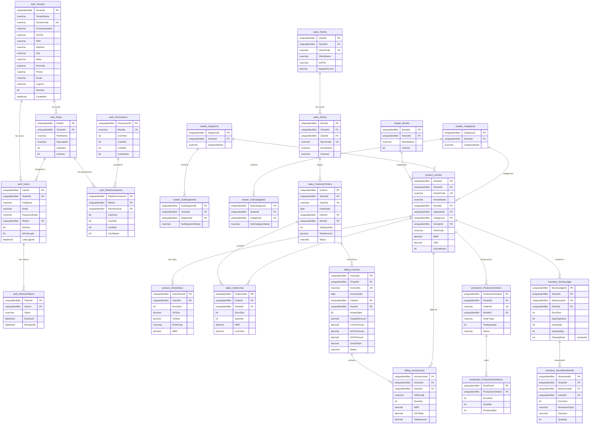

# RetailERP - Database Documentation

## Overview

RetailERP uses **SQL Server 2022** with a single database (`RetailERP`) organized into **9 schemas** containing **43 tables**. Multi-tenancy is enforced via a `TenantId` column on every business entity.

## Schema Organization

| Schema | Purpose | Table Count |
|--------|---------|------------|
| `auth` | Authentication, users, roles, permissions | 5 |
| `master` | Reference data (brands, categories, sizes, HSN codes) | 13 |
| `product` | Articles, footwear/leather details, sizes, images | 4 |
| `sales` | Clients, stores, customer orders, order lines | 5 |
| `inventory` | Stock ledger, movements, adjustments | 4 |
| `production` | Production orders, size runs | 2 |
| `billing` | Invoices, invoice lines, packing lists, delivery notes | 6 |
| `warehouse` | Warehouse definitions | 1 |
| `audit` | Audit log | 1 |
| | **Total** | **41** |

> Note: CustomerMasterEntries and StockAdjustmentLines are counted within their parent schemas. Exact count may vary slightly as some tables serve dual purposes.

## Entity Relationship Diagram

## Table Details

### Schema: `auth` -- Authentication & Authorization

#### auth.Tenants
Multi-tenant root table. Every business entity references a tenant.

| Column | Type | Nullable | Description |
|--------|------|----------|-------------|
| TenantId | UNIQUEIDENTIFIER | PK | Auto-generated sequential GUID |
| TenantName | NVARCHAR(200) | No | Display name |
| TenantCode | NVARCHAR(50) | No | Unique short code |
| CompanyName | NVARCHAR(300) | No | Legal company name |
| GSTIN | NVARCHAR(15) | Yes | GST Identification Number |
| PAN | NVARCHAR(10) | Yes | Permanent Account Number |
| Address | NVARCHAR(500) | Yes | Company address |
| City | NVARCHAR(100) | Yes | City |
| State | NVARCHAR(100) | Yes | State |
| PinCode | NVARCHAR(10) | Yes | PIN code |
| Phone | NVARCHAR(20) | Yes | Contact phone |
| Email | NVARCHAR(200) | Yes | Contact email |
| LogoUrl | NVARCHAR(500) | Yes | Company logo URL |
| IsActive | BIT | No | Active flag (default: 1) |
| CreatedAt | DATETIME2(7) | No | UTC creation timestamp |
| UpdatedAt | DATETIME2(7) | Yes | Last update timestamp |

**Constraints:** `UQ_Tenants_Code` (TenantCode)

#### auth.Roles
Role definitions per tenant.

| Column | Type | Nullable | Description |
|--------|------|----------|-------------|
| RoleId | UNIQUEIDENTIFIER | PK | |
| TenantId | UNIQUEIDENTIFIER | FK | References auth.Tenants |
| RoleName | NVARCHAR(100) | No | Role name (unique per tenant) |
| Description | NVARCHAR(500) | Yes | Role description |
| IsSystem | BIT | No | System role flag (default: 0) |
| IsActive | BIT | No | Active flag (default: 1) |
| CreatedAt | DATETIME2(7) | No | |

**Constraints:** `UQ_Roles_Name_Tenant` (TenantId, RoleName)

#### auth.Permissions
Module-level permission definitions (global, not per-tenant).

| Column | Type | Nullable | Description |
|--------|------|----------|-------------|
| PermissionId | UNIQUEIDENTIFIER | PK | |
| Module | NVARCHAR(100) | No | Module name (unique) |
| CanView | BIT | No | Default view permission |
| CanAdd | BIT | No | Default add permission |
| CanEdit | BIT | No | Default edit permission |
| CanDelete | BIT | No | Default delete permission |

**Seeded Modules:** Dashboard, Clients, Stores, Warehouses, Articles, MDA, Stock, Receipt, Dispatch, Returns, Analytics, Reports, Users, Roles, Audit, Brands, Genders, Seasons, Segments, Categories, Groups, Sizes, Production, Orders, Billing

#### auth.RolePermissions
Maps roles to permissions with specific CRUD flags.

| Column | Type | Nullable | Description |
|--------|------|----------|-------------|
| RolePermissionId | UNIQUEIDENTIFIER | PK | |
| RoleId | UNIQUEIDENTIFIER | FK | References auth.Roles |
| PermissionId | UNIQUEIDENTIFIER | FK | References auth.Permissions |
| CanView | BIT | No | |
| CanAdd | BIT | No | |
| CanEdit | BIT | No | |
| CanDelete | BIT | No | |

**Constraints:** `UQ_RolePerm` (RoleId, PermissionId)

#### auth.Users

| Column | Type | Nullable | Description |
|--------|------|----------|-------------|
| UserId | UNIQUEIDENTIFIER | PK | |
| TenantId | UNIQUEIDENTIFIER | FK | |
| FullName | NVARCHAR(200) | No | |
| Email | NVARCHAR(200) | No | Unique per tenant |
| PasswordHash | NVARCHAR(500) | No | BCrypt hash |
| RoleId | UNIQUEIDENTIFIER | FK | |
| AvatarUrl | NVARCHAR(500) | Yes | |
| IsActive | BIT | No | |
| IsFirstLogin | BIT | No | Triggers password change on first login |
| LastLoginAt | DATETIME2(7) | Yes | |
| CreatedBy | UNIQUEIDENTIFIER | Yes | |

**Constraints:** `UQ_Users_Email_Tenant` (TenantId, Email)

#### auth.RefreshTokens

| Column | Type | Nullable | Description |
|--------|------|----------|-------------|
| TokenId | UNIQUEIDENTIFIER | PK | |
| UserId | UNIQUEIDENTIFIER | FK | |
| Token | NVARCHAR(500) | No | Refresh token value |
| ExpiresAt | DATETIME2(7) | No | Expiry timestamp |
| CreatedAt | DATETIME2(7) | No | |
| RevokedAt | DATETIME2(7) | Yes | Null if active |
| ReplacedByToken | NVARCHAR(500) | Yes | For token rotation |

### Schema: `audit` -- Audit Trail

#### audit.AuditLog

| Column | Type | Nullable | Description |
|--------|------|----------|-------------|
| AuditId | BIGINT IDENTITY | PK | Auto-increment |
| TenantId | UNIQUEIDENTIFIER | No | |
| UserId | UNIQUEIDENTIFIER | Yes | Who performed the action |
| Action | NVARCHAR(50) | No | CREATE, UPDATE, DELETE |
| EntityType | NVARCHAR(100) | No | Table/entity name |
| EntityId | NVARCHAR(100) | Yes | Primary key of affected entity |
| OldValues | NVARCHAR(MAX) | Yes | JSON of previous values |
| NewValues | NVARCHAR(MAX) | Yes | JSON of new values |
| IpAddress | NVARCHAR(50) | Yes | Client IP |
| UserAgent | NVARCHAR(500) | Yes | Browser/client identifier |
| Timestamp | DATETIME2(7) | No | |

### Schema: `master` -- Reference Data

#### master.Brands

| Column | Type | Nullable | Description |
|--------|------|----------|-------------|
| BrandId | UNIQUEIDENTIFIER | PK | |
| TenantId | UNIQUEIDENTIFIER | FK | |
| BrandName | NVARCHAR(200) | No | Unique per tenant |
| IsActive | BIT | No | |
| CreatedBy | UNIQUEIDENTIFIER | Yes | |

#### master.Genders

| Column | Type | Description |
|--------|------|-------------|
| GenderId | UNIQUEIDENTIFIER | PK |
| TenantId | UNIQUEIDENTIFIER | FK |
| GenderName | NVARCHAR(50) | e.g., Men, Women, Unisex, Kids |

#### master.Seasons

| Column | Type | Description |
|--------|------|-------------|
| SeasonId | UNIQUEIDENTIFIER | PK |
| TenantId | UNIQUEIDENTIFIER | FK |
| SeasonCode | NVARCHAR(20) | e.g., SS24, AW24 |
| StartDate | DATE | Season start |
| EndDate | DATE | Season end (must be > StartDate) |

**Constraints:** `CK_Seasons_Dates` (EndDate > StartDate)

#### master.Segments
Product segments (e.g., Footwear, Leather Goods)

#### master.SubSegments
Sub-segments linked to parent segments (e.g., Formal, Casual, Sports)

#### master.Categories
Product categories (e.g., Shoes, Bags, Belts)

#### master.SubCategories
Sub-categories linked to parent categories (e.g., Derby, Oxford, Loafer, Sneaker)

#### master.Groups
Design families / collections

#### master.Colors

| Column | Type | Description |
|--------|------|-------------|
| ColorId | UNIQUEIDENTIFIER | PK |
| ColorName | NVARCHAR(100) | Color name |
| ColorCode | NVARCHAR(20) | Hex or code |

#### master.Styles
Style definitions for products

#### master.Fasteners
Fastener types (Lace-up, Velcro, Buckle, etc.)

#### master.SizeCharts
Size conversion chart (US, Euro, UK, Indian sizes)

| Column | Type | Description |
|--------|------|-------------|
| SizeChartId | UNIQUEIDENTIFIER | PK |
| ChartType | NVARCHAR(50) | 'Footwear' or 'Apparel' |
| GenderId | UNIQUEIDENTIFIER | FK to Genders |
| AgeGroup | NVARCHAR(50) | Adult, Kids, Toddler, Infant |
| USSize | DECIMAL(5,1) | US size |
| EuroSize | INT | European size |
| UKSize | DECIMAL(5,1) | UK size |
| IndSize | DECIMAL(5,1) | Indian size |
| Inches | DECIMAL(8,4) | Foot length in inches |
| CM | DECIMAL(5,1) | Foot length in cm |

#### master.HSNCodes
Harmonized System of Nomenclature codes for GST.

| Column | Type | Description |
|--------|------|-------------|
| HSNId | UNIQUEIDENTIFIER | PK |
| HSNCode | NVARCHAR(20) | HSN code (unique) |
| Description | NVARCHAR(500) | Description |
| GSTRate | DECIMAL(5,2) | GST rate (default: 18.00%) |

#### master.States
Indian states for GST compliance.

| Column | Type | Description |
|--------|------|-------------|
| StateId | INT | PK (GST state code number) |
| StateName | NVARCHAR(100) | State name |
| StateCode | NVARCHAR(5) | 2-digit GST state code |
| Zone | NVARCHAR(20) | NORTH, SOUTH, EAST, WEST, CENTRAL |

### Schema: `product` -- Product/Article Data

#### product.Articles
Core product table with rich categorization.

| Column | Type | Description |
|--------|------|-------------|
| ArticleId | UNIQUEIDENTIFIER | PK |
| TenantId | UNIQUEIDENTIFIER | FK |
| ArticleCode | NVARCHAR(50) | Unique per tenant |
| ArticleName | NVARCHAR(300) | |
| BrandId | UNIQUEIDENTIFIER | FK |
| SegmentId | UNIQUEIDENTIFIER | FK |
| SubSegmentId | UNIQUEIDENTIFIER | FK (optional) |
| CategoryId | UNIQUEIDENTIFIER | FK |
| SubCategoryId | UNIQUEIDENTIFIER | FK (optional) |
| GroupId | UNIQUEIDENTIFIER | FK (optional) |
| SeasonId | UNIQUEIDENTIFIER | FK (optional) |
| GenderId | UNIQUEIDENTIFIER | FK |
| ColorId | UNIQUEIDENTIFIER | FK (optional) |
| Color | NVARCHAR(100) | Color name |
| Style | NVARCHAR(100) | Style description |
| Fastener | NVARCHAR(100) | Fastener type |
| HSNCode | NVARCHAR(20) | GST HSN code |
| UOM | NVARCHAR(20) | Unit of measure (default: PAIRS) |
| MRP | DECIMAL(12,2) | Maximum retail price |
| CBD | DECIMAL(12,2) | Cost breakdown |
| IsSizeBased | BIT | Whether article has size variants |
| ImageUrl | NVARCHAR(500) | Primary image |
| LaunchDate | DATE | Product launch date |

#### product.FootwearDetails
Extended attributes for footwear articles.

| Column | Type | Description |
|--------|------|-------------|
| FootwearDetailId | UNIQUEIDENTIFIER | PK |
| ArticleId | UNIQUEIDENTIFIER | FK (unique) |
| Last | NVARCHAR(100) | Shoe last |
| UpperLeather | NVARCHAR(200) | Upper material |
| LiningLeather | NVARCHAR(200) | Lining material |
| Sole | NVARCHAR(200) | Sole material |
| SizeRunFrom | INT | Starting size |
| SizeRunTo | INT | Ending size |

#### product.LeatherGoodsDetails
Extended attributes for bags/belts.

| Column | Type | Description |
|--------|------|-------------|
| LeatherGoodsDetailId | UNIQUEIDENTIFIER | PK |
| ArticleId | UNIQUEIDENTIFIER | FK (unique) |
| Dimensions | NVARCHAR(100) | L x W x H |
| Security | NVARCHAR(100) | Security features |

#### product.ArticleSizes
Size-wise breakdown per article.

| Column | Type | Description |
|--------|------|-------------|
| ArticleSizeId | UNIQUEIDENTIFIER | PK |
| ArticleId | UNIQUEIDENTIFIER | FK |
| EuroSize | INT | European size |
| UKSize | DECIMAL(5,1) | UK size |
| USSize | DECIMAL(5,1) | US size |
| EANCode | NVARCHAR(20) | Barcode/EAN |
| MRP | DECIMAL(12,2) | Size-specific MRP override |

**Constraints:** `UQ_ArticleSizes_Article_Size` (ArticleId, EuroSize)

#### product.ArticleImages

| Column | Type | Description |
|--------|------|-------------|
| ImageId | UNIQUEIDENTIFIER | PK |
| ArticleId | UNIQUEIDENTIFIER | FK |
| ImageUrl | NVARCHAR(500) | Image URL |
| DisplayOrder | INT | Sort order |
| IsPrimary | BIT | Primary image flag |

### Schema: `sales` -- Customer & Order Data

#### sales.Clients
B2B distribution clients.

| Column | Type | Description |
|--------|------|-------------|
| ClientId | UNIQUEIDENTIFIER | PK |
| TenantId | UNIQUEIDENTIFIER | FK |
| ClientCode | NVARCHAR(50) | Unique per tenant |
| ClientName | NVARCHAR(300) | |
| Organisation | NVARCHAR(300) | Legal entity name |
| GSTIN | NVARCHAR(15) | GST number |
| PAN | NVARCHAR(10) | PAN number |
| StateId | INT | FK to States |
| MarginPercent | DECIMAL(5,2) | Default margin |
| MarginType | NVARCHAR(20) | NET OF TAXES / ON MRP |

#### sales.Stores
Retail store locations linked to clients.

| Column | Type | Description |
|--------|------|-------------|
| StoreId | UNIQUEIDENTIFIER | PK |
| ClientId | UNIQUEIDENTIFIER | FK |
| StoreCode | NVARCHAR(50) | Unique per tenant |
| StoreName | NVARCHAR(300) | |
| Format | NVARCHAR(50) | RETAIL_MALL, RETAIL_HIGH_STREET, OUTLET |
| Channel | NVARCHAR(50) | MBO, EBO, DISTRIBUTOR |
| ModusOperandi | NVARCHAR(10) | SOR (Sale or Return), OUT_MKT |
| MarginPercent | DECIMAL(5,2) | Store-level margin override |

#### sales.CustomerOrders

| Column | Type | Description |
|--------|------|-------------|
| OrderId | UNIQUEIDENTIFIER | PK |
| OrderNo | NVARCHAR(50) | Unique per tenant |
| OrderDate | DATE | |
| ClientId | UNIQUEIDENTIFIER | FK |
| StoreId | UNIQUEIDENTIFIER | FK |
| WarehouseId | UNIQUEIDENTIFIER | FK (optional) |
| TotalQuantity | INT | |
| TotalMRP | DECIMAL(14,2) | |
| TotalAmount | DECIMAL(14,2) | |
| Status | NVARCHAR(30) | DRAFT, CONFIRMED, PROCESSING, DISPATCHED, DELIVERED, CANCELLED |

#### sales.OrderLines

| Column | Type | Description |
|--------|------|-------------|
| OrderLineId | UNIQUEIDENTIFIER | PK |
| OrderId | UNIQUEIDENTIFIER | FK |
| ArticleId | UNIQUEIDENTIFIER | FK |
| EuroSize | INT | Size ordered |
| HSNCode | NVARCHAR(20) | |
| MRP | DECIMAL(12,2) | |
| Quantity | INT | Ordered quantity (> 0) |
| DispatchedQty | INT | Already dispatched |
| LineTotal | DECIMAL(14,2) | |
| StockAvailable | BIT | Stock availability flag |

#### sales.CustomerMasterEntries
Detailed billing/shipping addresses per store (for invoicing).

| Key Columns | Description |
|-------------|-------------|
| CustomerEntryId | PK |
| StoreId, ClientId | FK references |
| BillingAddress1-5 | Multi-line billing address |
| BillingPinCode, BillingCity, BillingState | Billing location |
| ShippingAddress1-3 | Multi-line shipping address |
| SameAsBilling | Flag for same address |
| GSTIN, GSTStateCode, PAN | Tax identifiers |
| BusinessChannel | MBO, EBO |
| BusinessModule | SOR, OUT_MKT |
| MarginPercent, MarginType | Business terms |

### Schema: `warehouse`

#### warehouse.Warehouses

| Column | Type | Description |
|--------|------|-------------|
| WarehouseId | UNIQUEIDENTIFIER | PK |
| TenantId | UNIQUEIDENTIFIER | FK |
| WarehouseCode | NVARCHAR(50) | Unique per tenant |
| WarehouseName | NVARCHAR(300) | |
| Address | NVARCHAR(500) | |
| City, State, PinCode | Location |

### Schema: `inventory` -- Stock Management

#### inventory.StockLedger
Current stock position per article/size/warehouse.

| Column | Type | Description |
|--------|------|-------------|
| StockLedgerId | UNIQUEIDENTIFIER | PK |
| TenantId | UNIQUEIDENTIFIER | FK |
| WarehouseId | UNIQUEIDENTIFIER | FK |
| ArticleId | UNIQUEIDENTIFIER | FK |
| EuroSize | INT | Size (nullable for non-sized items) |
| OpeningStock | INT | Opening balance |
| InwardQty | INT | Total inward |
| OutwardQty | INT | Total outward |
| ClosingStock | INT | **Computed:** OpeningStock + InwardQty - OutwardQty |
| LastUpdated | DATETIME2(7) | |

**Constraints:**
- `UQ_StockLedger` (TenantId, WarehouseId, ArticleId, EuroSize)
- `CK_StockLedger_Positive` (ClosingStock >= 0)

#### inventory.StockMovements
Transaction log of all stock movements.

| Column | Type | Description |
|--------|------|-------------|
| MovementId | UNIQUEIDENTIFIER | PK |
| MovementType | NVARCHAR(30) | OPENING, PURCHASE, PRODUCTION, SALES, RETURN, ADJUSTMENT |
| Direction | NVARCHAR(10) | INWARD or OUTWARD |
| Quantity | INT | Must be > 0 |
| ReferenceType | NVARCHAR(50) | ProductionOrder, CustomerOrder, StockAdjustment |
| ReferenceId | UNIQUEIDENTIFIER | Link to source document |
| Notes | NVARCHAR(500) | |
| MovementDate | DATETIME2(7) | |

#### inventory.StockAdjustments

| Column | Type | Description |
|--------|------|-------------|
| AdjustmentId | UNIQUEIDENTIFIER | PK |
| AdjustmentNo | NVARCHAR(50) | Document number |
| AdjustmentDate | DATE | |
| Reason | NVARCHAR(500) | Reason for adjustment |
| Status | NVARCHAR(20) | DRAFT, APPROVED, CANCELLED |
| ApprovedBy | UNIQUEIDENTIFIER | Approver |

#### inventory.StockAdjustmentLines

| Column | Type | Description |
|--------|------|-------------|
| AdjustmentLineId | UNIQUEIDENTIFIER | PK |
| AdjustmentId | UNIQUEIDENTIFIER | FK |
| ArticleId | UNIQUEIDENTIFIER | FK |
| EuroSize | INT | |
| AdjustmentType | NVARCHAR(10) | ADD or REMOVE |
| Quantity | INT | |

### Schema: `production`

#### production.ProductionOrders

| Column | Type | Description |
|--------|------|-------------|
| ProductionOrderId | UNIQUEIDENTIFIER | PK |
| OrderNo | NVARCHAR(50) | Unique per tenant |
| OrderDate | DATE | |
| ArticleId | UNIQUEIDENTIFIER | FK |
| Color | NVARCHAR(100) | |
| Last | NVARCHAR(100) | Shoe last |
| UpperLeather | NVARCHAR(200) | |
| LiningLeather | NVARCHAR(200) | |
| Sole | NVARCHAR(200) | |
| OrderType | NVARCHAR(50) | REPLENISHMENT, FRESH, SAMPLE |
| TotalQuantity | INT | |
| Status | NVARCHAR(30) | DRAFT, APPROVED, IN_PRODUCTION, COMPLETED, CANCELLED |
| UpperCuttingDies | NVARCHAR(100) | |
| MaterialCuttingDies | NVARCHAR(100) | |
| SocksInsoleCuttingDies | NVARCHAR(100) | |

#### production.ProductionSizeRuns
Size-wise quantity distribution.

| Column | Type | Description |
|--------|------|-------------|
| SizeRunId | UNIQUEIDENTIFIER | PK |
| ProductionOrderId | UNIQUEIDENTIFIER | FK |
| EuroSize | INT | |
| Quantity | INT | Ordered quantity (>= 0) |
| ProducedQty | INT | Produced so far (<= Quantity) |

### Schema: `billing` -- Invoicing

#### billing.Invoices
GST-compliant tax invoices.

| Column | Type | Description |
|--------|------|-------------|
| InvoiceId | UNIQUEIDENTIFIER | PK |
| InvoiceNo | NVARCHAR(50) | Unique per tenant |
| InvoiceDate | DATE | |
| InvoiceType | NVARCHAR(30) | TAX_INVOICE, CREDIT_NOTE, DEBIT_NOTE |
| OrderId | UNIQUEIDENTIFIER | FK (optional, linked order) |
| ClientId | UNIQUEIDENTIFIER | FK |
| StoreId | UNIQUEIDENTIFIER | FK |
| BillToName/Address/GSTIN/State | Billing party details |
| ShipToName/Address/GSTIN/State | Shipping party details |
| PlaceOfSupply | NVARCHAR(100) | Determines tax type |
| IsInterState | BIT | IGST if true, CGST+SGST if false |
| SubTotal | DECIMAL(14,2) | |
| TotalDiscount | DECIMAL(14,2) | |
| TaxableAmount | DECIMAL(14,2) | |
| CGSTAmount | DECIMAL(14,2) | Central GST |
| SGSTAmount | DECIMAL(14,2) | State GST |
| IGSTAmount | DECIMAL(14,2) | Integrated GST |
| TotalGST | DECIMAL(14,2) | |
| GrandTotal | DECIMAL(14,2) | |
| RoundOff | DECIMAL(8,2) | |
| NetPayable | DECIMAL(14,2) | |
| Status | NVARCHAR(20) | DRAFT, FINALIZED, CANCELLED |
| IRN | NVARCHAR(100) | e-Invoice Reference Number |
| EWayBillNo | NVARCHAR(50) | e-Way Bill Number |

#### billing.InvoiceLines
Line items with full GST breakdown.

| Column | Type | Description |
|--------|------|-------------|
| InvoiceLineId | UNIQUEIDENTIFIER | PK |
| InvoiceId | UNIQUEIDENTIFIER | FK |
| ArticleId | UNIQUEIDENTIFIER | FK |
| ArticleCode | NVARCHAR(50) | Denormalized |
| HSNCode | NVARCHAR(20) | |
| EuroSize | INT | |
| EANCode | NVARCHAR(20) | Barcode |
| Quantity | INT | |
| MRP | DECIMAL(12,2) | |
| MarginPercent | DECIMAL(5,2) | |
| MarginAmount | DECIMAL(12,2) | |
| UnitPrice | DECIMAL(12,2) | MRP - Margin |
| TaxableAmount | DECIMAL(14,2) | UnitPrice x Qty |
| GSTRate | DECIMAL(5,2) | (default: 18.00%) |
| CGSTRate/Amount | DECIMAL | Central GST split |
| SGSTRate/Amount | DECIMAL | State GST split |
| IGSTRate/Amount | DECIMAL | Integrated GST (inter-state) |
| TotalAmount | DECIMAL(14,2) | |

#### billing.PackingLists

| Column | Type | Description |
|--------|------|-------------|
| PackingListId | UNIQUEIDENTIFIER | PK |
| InvoiceId | UNIQUEIDENTIFIER | FK |
| PackingNo | NVARCHAR(50) | |
| PackingDate | DATE | |
| TotalCartons | INT | |
| TotalPairs | INT | |
| TransportMode | NVARCHAR(50) | ROAD, AIR, RAIL, SEA |
| LogisticsPartner | NVARCHAR(200) | |
| VehicleNumber | NVARCHAR(50) | |
| LRNumber | NVARCHAR(50) | Lorry Receipt number |
| LRDate | DATE | |

#### billing.PackingListLines

| Column | Type | Description |
|--------|------|-------------|
| PackingLineId | UNIQUEIDENTIFIER | PK |
| PackingListId | UNIQUEIDENTIFIER | FK |
| CartonNumber | INT | Carton number |
| ArticleId | UNIQUEIDENTIFIER | FK |
| EuroSize | INT | |
| Quantity | INT | |

#### billing.DeliveryNotes

| Column | Type | Description |
|--------|------|-------------|
| DeliveryNoteId | UNIQUEIDENTIFIER | PK |
| InvoiceId | UNIQUEIDENTIFIER | FK |
| DeliveryNoteNo | NVARCHAR(50) | |
| DeliveryDate | DATE | |
| ReceivedBy | NVARCHAR(200) | |
| ReceivedAt | DATETIME2(7) | |
| Status | NVARCHAR(20) | PENDING, DELIVERED, PARTIAL |

## SQL Script Execution Order

Run these scripts sequentially to set up the database:

| Order | File | Description |
|-------|------|-------------|
| 1 | `database/schemas/001_create_schemas.sql` | Create 9 schemas |
| 2 | `database/tables/002_auth_tables.sql` | Auth + audit tables |
| 3 | `database/tables/003_master_tables.sql` | Master data tables |
| 4 | `database/tables/004_product_tables.sql` | Product tables |
| 5 | `database/tables/005_customer_tables.sql` | Client/store tables |
| 6 | `database/tables/006_warehouse_inventory_tables.sql` | Warehouse + inventory |
| 7 | `database/tables/007_production_tables.sql` | Production tables |
| 8 | `database/tables/008_order_tables.sql` | Order tables |
| 9 | `database/tables/009_billing_tables.sql` | Billing tables |
| 10 | `database/indexes/010_indexes.sql` | Performance indexes |
| 11 | `database/seed-data/011_seed_data.sql` | Initial data (permissions, states, HSN codes) |
| 12 | `database/stored-procedures/sp_*.sql` | Stored procedures |

## Stored Procedures

| File | Description |
|------|-------------|
| `sp_articles.sql` | Article search and lookup procedures |
| `sp_billing.sql` | Invoice generation and GST calculation |
| `sp_brands.sql` | Brand management procedures |
| `sp_inventory.sql` | Stock ledger updates and movement recording |
