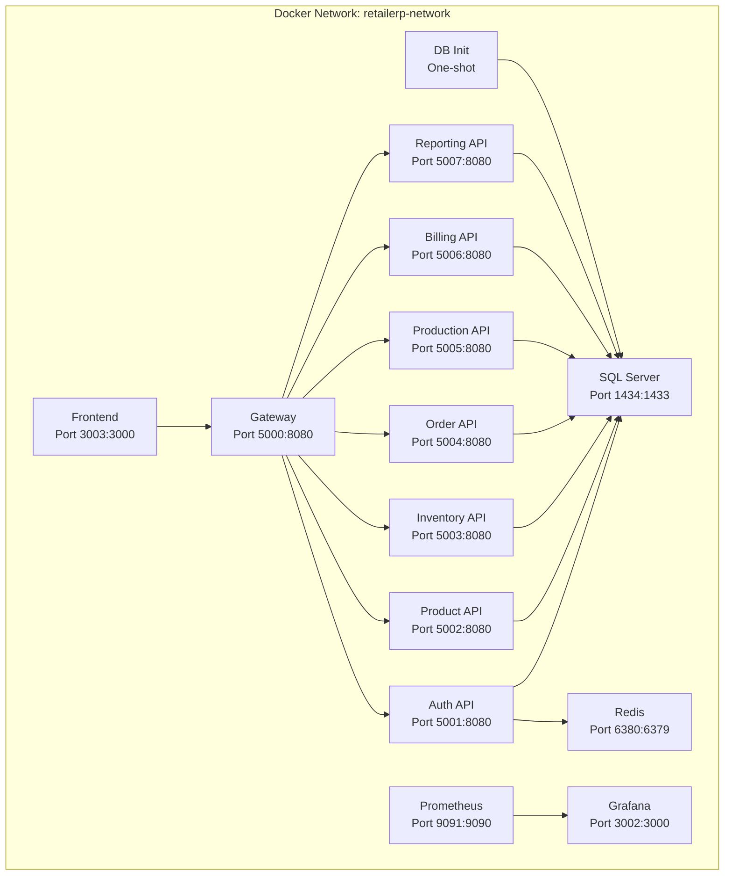

# RetailERP - Deployment Guide

## Prerequisites

| Requirement | Version |
|------------|---------|
| Docker Desktop | 4.x+ |
| .NET SDK | 8.0+ (runtime targets net7.0) |
| Node.js | 20+ |
| SQL Server | 2022 (or use Docker image) |
| kubectl | 1.28+ (for Kubernetes) |

## Docker Compose (Recommended for Development)

### Quick Start

```bash
# Clone the repository
git clone <repo-url>
cd RetailERP

# Start all services
docker-compose up -d

# The db-init container auto-initializes the database
# Wait ~30 seconds for SQL Server health check to pass
```

### Architecture



### Service URLs

| Service | Host URL | Container Port |
|---------|----------|----------------|
| Frontend | http://localhost:3003 | 3000 |
| API Gateway | http://localhost:5000 | 8080 |
| Auth API | http://localhost:5001 | 8080 |
| Product API | http://localhost:5002 | 8080 |
| Inventory API | http://localhost:5003 | 8080 |
| Order API | http://localhost:5004 | 8080 |
| Production API | http://localhost:5005 | 8080 |
| Billing API | http://localhost:5006 | 8080 |
| Reporting API | http://localhost:5007 | 8080 |
| SQL Server | localhost:1434 | 1433 |
| Redis | localhost:6380 | 6379 |
| Prometheus | http://localhost:9091 | 9090 |
| Grafana | http://localhost:3002 | 3000 |

### Docker Compose Services

The `docker-compose.yml` defines these services:

**Infrastructure:**
- `sqlserver` -- SQL Server 2022 Developer edition with health check
- `redis` -- Redis 7 Alpine with health check
- `db-init` -- One-shot container that runs all SQL scripts in order

**Observability:**
- `prometheus` -- Metrics scraping from all services
- `grafana` -- Dashboard visualization (admin/admin)

**Microservices (auth-api, product-api, inventory-api, order-api, production-api, billing-api, reporting-api):**
- All built from `docker/Dockerfile.api` with service-specific build args
- All share common environment variables via YAML anchor
- Health checks on `/health` endpoint
- `restart: unless-stopped`
- Depends on `sqlserver` (healthy)

**Gateway:**
- Built from `docker/Dockerfile.gateway`
- Depends on `auth-api` (healthy)
- CORS configured for frontend origins

**Frontend:**
- Built from `docker/Dockerfile.frontend`
- Depends on `gateway`

### Dockerfiles

| File | Purpose |
|------|---------|
| `docker/Dockerfile.api` | Multi-stage build for .NET microservices (accepts SERVICE_NAME and SERVICE_DIR build args) |
| `docker/Dockerfile.gateway` | YARP gateway build |
| `docker/Dockerfile.frontend` | Next.js production build |

### Volumes

| Volume | Purpose |
|--------|---------|
| `sqlserver-data` | SQL Server data persistence |
| `redis-data` | Redis data persistence |
| `prometheus-data` | Prometheus metrics storage |
| `grafana-data` | Grafana dashboards and config |

### Common Commands

```bash
# Start all services
docker-compose up -d

# View logs
docker-compose logs -f auth-api
docker-compose logs -f gateway

# Rebuild a specific service
docker-compose up -d --build auth-api

# Stop all services
docker-compose down

# Stop and remove volumes (reset everything)
docker-compose down -v

# Check service health
docker-compose ps

# Execute SQL against the database
docker exec -it retailerp-sqlserver /opt/mssql-tools18/bin/sqlcmd \
  -S localhost -U sa -P "RetailERP@2024!" -C -d RetailERP
```

## Environment Variables

### Common (All .NET Services)

| Variable | Description | Default |
|----------|-------------|---------|
| `ASPNETCORE_ENVIRONMENT` | Runtime environment | `Docker` |
| `ASPNETCORE_URLS` | Listening URL | `http://+:8080` |
| `ConnectionStrings__DefaultConnection` | SQL Server connection string | See compose |
| `Jwt__Secret` | JWT signing key (min 32 chars) | See compose |
| `Jwt__Issuer` | JWT token issuer | `RetailERP.Auth` |
| `Jwt__Audience` | JWT token audience | `RetailERP.Client` |

### Gateway-Specific

| Variable | Description | Default |
|----------|-------------|---------|
| `Cors__Origins__0` | Allowed CORS origin 1 | `http://localhost:3000` |
| `Cors__Origins__1` | Allowed CORS origin 2 | `http://localhost:3001` |
| `Cors__Origins__2` | Allowed CORS origin 3 | `http://localhost:3003` |

### Frontend

| Variable | Description | Default |
|----------|-------------|---------|
| `NEXT_PUBLIC_API_URL` | API Gateway URL | `http://localhost:5000` |

### SQL Server

| Variable | Description | Default |
|----------|-------------|---------|
| `ACCEPT_EULA` | Accept license | `Y` |
| `MSSQL_SA_PASSWORD` | SA password | `RetailERP@2024!` |
| `MSSQL_PID` | SQL Server edition | `Developer` |

### Grafana

| Variable | Description | Default |
|----------|-------------|---------|
| `GF_SECURITY_ADMIN_PASSWORD` | Admin password | `admin` |

## Database Setup

### Automatic (Docker Compose)

The `db-init` service automatically runs all SQL scripts in order when the database container is healthy. No manual intervention needed.

### Manual Setup

```bash
# 1. Create the database
sqlcmd -S localhost,1434 -U sa -P "RetailERP@2024!" -C \
  -Q "CREATE DATABASE RetailERP"

# 2. Run scripts in order
sqlcmd -S localhost,1434 -U sa -P "RetailERP@2024!" -C -d RetailERP \
  -i database/schemas/001_create_schemas.sql

sqlcmd -S localhost,1434 -U sa -P "RetailERP@2024!" -C -d RetailERP \
  -i database/tables/002_auth_tables.sql

# ... continue for all scripts through 011_seed_data.sql

# 3. Run stored procedures
sqlcmd -S localhost,1434 -U sa -P "RetailERP@2024!" -C -d RetailERP \
  -i database/stored-procedures/sp_articles.sql
sqlcmd -S localhost,1434 -U sa -P "RetailERP@2024!" -C -d RetailERP \
  -i database/stored-procedures/sp_billing.sql
sqlcmd -S localhost,1434 -U sa -P "RetailERP@2024!" -C -d RetailERP \
  -i database/stored-procedures/sp_brands.sql
sqlcmd -S localhost,1434 -U sa -P "RetailERP@2024!" -C -d RetailERP \
  -i database/stored-procedures/sp_inventory.sql
```

### Script Execution Order

| # | File | Description |
|---|------|-------------|
| 1 | `schemas/001_create_schemas.sql` | Creates 9 schemas |
| 2 | `tables/002_auth_tables.sql` | Auth + audit tables |
| 3 | `tables/003_master_tables.sql` | 13 master data tables |
| 4 | `tables/004_product_tables.sql` | 4 product tables |
| 5 | `tables/005_customer_tables.sql` | 3 customer/store tables |
| 6 | `tables/006_warehouse_inventory_tables.sql` | 5 warehouse + inventory tables |
| 7 | `tables/007_production_tables.sql` | 2 production tables |
| 8 | `tables/008_order_tables.sql` | 2 order tables |
| 9 | `tables/009_billing_tables.sql` | 6 billing tables |
| 10 | `indexes/010_indexes.sql` | Performance indexes |
| 11 | `seed-data/011_seed_data.sql` | Permissions, states, HSN codes |
| 12 | `stored-procedures/sp_*.sql` | 4 stored procedure files |

## Kubernetes Deployment

### Manifests

| File | Description |
|------|-------------|
| `k8s/00-namespace.yaml` | `retailerp` namespace |
| `k8s/01-secrets.yaml` | Database connection string, JWT secret |
| `k8s/02-configmap.yaml` | Common environment configuration |
| `k8s/03-infrastructure.yaml` | SQL Server, Redis deployments and services |
| `k8s/04-microservices.yaml` | All 7 microservice deployments (2 replicas each) |
| `k8s/05-gateway.yaml` | YARP gateway deployment and service |
| `k8s/06-frontend.yaml` | Frontend deployment and service |
| `k8s/07-observability.yaml` | Prometheus and Grafana |
| `k8s/08-ingress.yaml` | Ingress controller rules |

### Deployment Steps

```bash
# 1. Create namespace
kubectl apply -f k8s/00-namespace.yaml

# 2. Create secrets
kubectl create secret generic retailerp-secrets \
  --from-literal=db-connection-string="Server=sqlserver;Database=RetailERP;User Id=sa;Password=RetailERP@2024!;TrustServerCertificate=true" \
  --from-literal=jwt-secret="RetailERP-SuperSecret-JWT-Key-2024-Must-Be-At-Least-32-Characters" \
  -n retailerp

# 3. Apply all manifests
kubectl apply -f k8s/ -n retailerp

# 4. Verify deployment
kubectl get pods -n retailerp
kubectl get svc -n retailerp
kubectl get ingress -n retailerp
```

### Resource Allocation (per microservice)

| Resource | Request | Limit |
|----------|---------|-------|
| Memory | 256Mi | 512Mi |
| CPU | 250m | 500m |

### Scaling

```bash
# Scale a service
kubectl scale deployment auth-api --replicas=3 -n retailerp

# Horizontal Pod Autoscaler (example)
kubectl autoscale deployment auth-api --min=2 --max=5 --cpu-percent=70 -n retailerp
```

### Prometheus Annotations

All microservice pods include Prometheus scraping annotations:

```yaml
annotations:
  prometheus.io/scrape: "true"
  prometheus.io/port: "8080"
  prometheus.io/path: "/metrics"
```

## Monitoring & Observability

### Health Checks

Every service exposes a `/health` endpoint:

```bash
curl http://localhost:5000/health   # Gateway
curl http://localhost:5001/health   # Auth
curl http://localhost:5002/health   # Product
# ... etc
```

### Prometheus

- **URL**: http://localhost:9091 (Docker) or port 9090 (K8s)
- **Config**: `docker/prometheus.yml`
- Scrapes `/metrics` from all .NET services
- Uses `prometheus-net` library for .NET metrics

### Grafana

- **URL**: http://localhost:3002 (Docker)
- **Login**: admin / admin
- Connect Prometheus as data source
- Pre-built dashboards for .NET application metrics

### Serilog Logging

All services use Serilog with structured logging:
- Console sink (always active)
- Configurable additional sinks via `appsettings.json`
- Request logging via `UseSerilogRequestLogging()`

## Default Credentials

| Service | Username | Password |
|---------|----------|----------|
| SQL Server | sa | RetailERP@2024! |
| Grafana | admin | admin |
| RetailERP Admin | admin@elcurio.com | Admin@123 |
| RetailERP Warehouse | warehouse@elcurio.com | Admin@123 |
| RetailERP Accounts | accounts@elcurio.com | Admin@123 |
| RetailERP Viewer | viewer@elcurio.com | Admin@123 |

## Production Considerations

1. **Secrets Management** -- Use Kubernetes secrets or a vault solution. Never commit real passwords.
2. **Database** -- Use Azure SQL or managed SQL Server instead of container.
3. **Redis** -- Use Azure Cache for Redis or managed Redis.
4. **SSL/TLS** -- Configure HTTPS with proper certificates on ingress.
5. **Image Registry** -- Push images to a private container registry.
6. **Backup** -- Configure SQL Server backups and point-in-time recovery.
7. **Rate Limiting** -- Adjust limits based on expected traffic patterns.
8. **CORS** -- Restrict to actual production frontend domain.
9. **JWT Secret** -- Use a strong, rotatable secret with at least 256 bits.
10. **Logging** -- Configure Serilog to write to centralized logging (ELK, Seq, Application Insights).
