# RetailERP User Manual

> Complete guide for end users of the EL CURIO RetailERP platform -- a retail distribution and ERP system for footwear, bags, belts, and leather goods.

**Version:** 2.1
**Last Updated:** 2026-03-20
**Platform:** Web Application (Desktop & Mobile Browsers)

---

## Table of Contents

1. [Getting Started](#1-getting-started)
2. [Master Data Entry](#2-master-data-entry)
3. [Customer Management](#3-customer-management)
4. [Inventory Management](#4-inventory-management)
5. [Order Management](#5-order-management)
6. [Billing](#6-billing)
7. [Reports](#7-reports)
8. [Administration](#8-administration)
9. [Common Operations](#9-common-operations)
10. [Frequently Asked Questions](#10-frequently-asked-questions)
11. [Documentation Portal](#11-documentation-portal)

---

## 1. Getting Started

### 1.1 Login

Open your browser and navigate to the RetailERP URL provided by your administrator (e.g., `https://erp.elcurio.com` or `http://localhost:3000`). You will be greeted by the login page featuring the EL CURIO branding with an animated 3D ERP cube display.

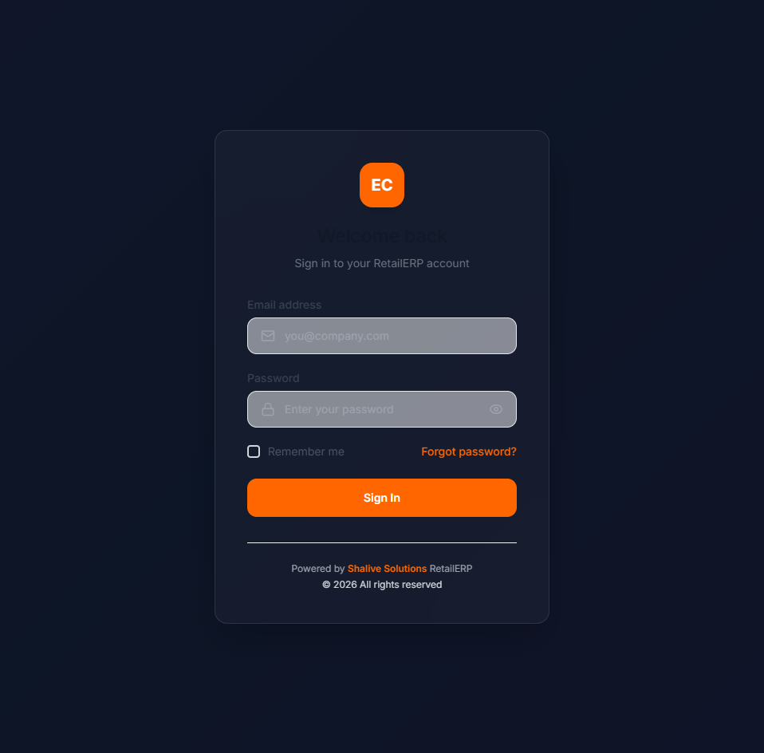

**To log in:**

1. Enter your **Email** in the email field.
2. Enter your **Password** in the password field.
3. Click the **Sign In** button.
4. On first login, you may be prompted to change your default password.

**Default credentials (provided by your system administrator):**

| Role | Email | Default Password |
|------|-------|------------------|
| Admin | admin@elcurio.com | Admin@123 |
| Warehouse | warehouse@elcurio.com | Admin@123 |
| Accounts | accounts@elcurio.com | Admin@123 |
| Viewer | viewer@elcurio.com | Admin@123 |

> **Security Note:** Change default passwords immediately after first login. Passwords should be at least 8 characters and include a mix of uppercase, lowercase, numbers, and special characters.

### 1.2 Dashboard Overview

After a successful login, you are taken to the Dashboard -- the central hub of RetailERP. The dashboard provides a real-time overview of your business operations at a glance.

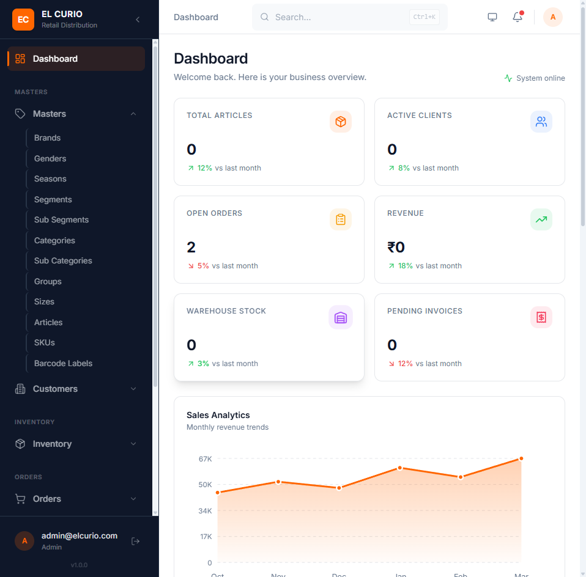

The dashboard is divided into the following sections:

**KPI Summary Cards (Top Row)**

Six cards display key performance metrics, each with a trend indicator comparing to the previous period:

| Card | Description |
|------|-------------|
| **Total Articles** | Number of active products in the catalog |
| **Active Clients** | Number of active B2B customer accounts |
| **Open Orders** | Customer orders currently in progress |
| **Revenue** | Total revenue from finalized sales |
| **Warehouse Stock** | Total quantity of items currently in stock |
| **Pending Invoices** | Invoices awaiting finalization or payment |

**Charts and Analytics**

- **Sales Analytics** -- A line/area chart displaying monthly revenue trends. Hover over any data point to see the exact value for that period.
- **Inventory by Category** -- A donut chart showing stock distribution across product categories (Footwear, Bags, Belts).
- **Production Orders** -- A bar chart visualizing the production pipeline by status (Draft, Approved, In Progress, Completed).

**Recent Activity**

A timeline panel on the right side displays the latest operations across the system, including new orders, stock movements, invoice creation, and user actions. Each entry shows the action type, description, user, and timestamp.

**Quick Actions**

Shortcut buttons provide one-click access to common tasks:
- **New Order** -- Jump directly to order creation
- **New Article** -- Create a new product in the catalog
- **Stock Receipt** -- Record incoming goods at the warehouse
- **Generate Invoice** -- Create a new tax invoice

**Recent Orders Table**

The bottom section shows the 5 most recent customer orders with order number, client name, total amount, status badge, and date.

### 1.3 Navigation

RetailERP uses a three-part navigation system:

**Sidebar (Left Panel)**

The primary navigation sidebar is organized into collapsible sections:

- **Dashboard** -- Home page with KPIs and charts
- **Masters** -- Reference data (Brands, Genders, Seasons, Segments, Sub Segments, Categories, Sub Categories, Groups, Sizes, Articles, SKUs)
- **Customers** -- Client and store management
- **Inventory** -- Stock overview, receipts, dispatch, returns, adjustments, transactions, stock freeze
- **Orders** -- Customer orders and sales channels
- **Production** -- Production orders and tracking
- **Billing** -- Invoices, packing lists, delivery notes
- **Reports** -- All report types in a tabbed interface
- **Administration** -- Users, roles, audit log, company master, license

Sidebar features:
- Click any section header to expand or collapse its sub-menu items.
- Click the collapse arrow (chevron icon) at the top to minimize the sidebar to icon-only mode (72px width) for more screen space.
- The currently active page is highlighted with an accent-colored indicator bar.
- Your user name and role appear at the bottom of the sidebar.
- On mobile devices, the sidebar opens as a slide-over overlay via the hamburger menu.

**Breadcrumbs (Top Bar)**

The header bar displays breadcrumb navigation showing your current location in the application hierarchy (e.g., Dashboard > Masters > Brands). Click any breadcrumb segment to navigate back to that level.

**Global Search (Ctrl+K)**

Press **Ctrl+K** (or **Cmd+K** on Mac) from any page to open the global search palette. Type to search across all modules -- articles, clients, orders, invoices, and more. Results are grouped by module and clicking a result navigates directly to that record.

---

## 2. Master Data Entry

The Masters module contains all reference data that the rest of the system depends on. These lookup tables must be populated before you can create articles, place orders, or generate invoices. Each master module follows a consistent interface pattern with list views, add/edit modals, and standard CRUD operations.

> **Important:** Set up master data in the order presented below, as some modules depend on others (e.g., Sub Segments require Segments to exist first).

---

### 2.1 Brands

**Path:** Dashboard > Masters > Brands

Brands represent the product brand labels under which your articles are marketed and sold. Each article in the catalog is associated with exactly one brand.

**List View**

The Brands list displays all registered brands in a searchable, paginated table. The system currently contains 7 brand records.

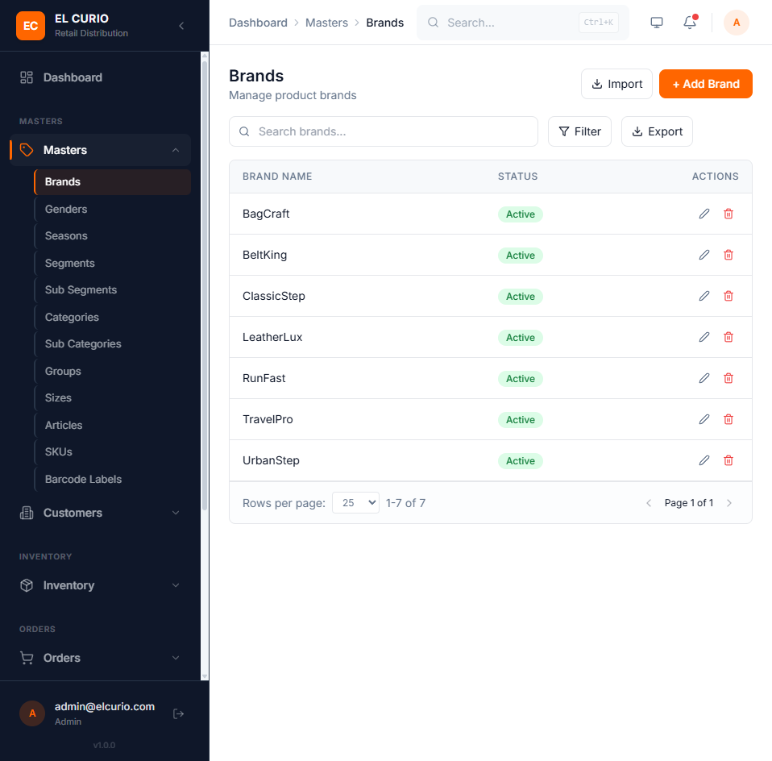

**Current brand records:** BagCraft, BeltKing, ClassicStep, LeatherLux, RunFast, TravelPro, UrbanStep.

**Field Descriptions**

| Field | Type | Required | Description |
|-------|------|----------|-------------|
| Brand Name | Text | Yes | The display name of the brand (e.g., "LeatherLux"). Must be unique across all brands. |
| Active | Toggle | Yes | Whether the brand is available for selection when creating articles. Inactive brands are hidden from dropdowns but preserved in existing records. |

**How to Add a Brand**

1. Navigate to **Dashboard > Masters > Brands**.
2. Click the **"+ Add Brand"** button in the top-right corner of the page.
3. A modal dialog appears with the brand entry form.

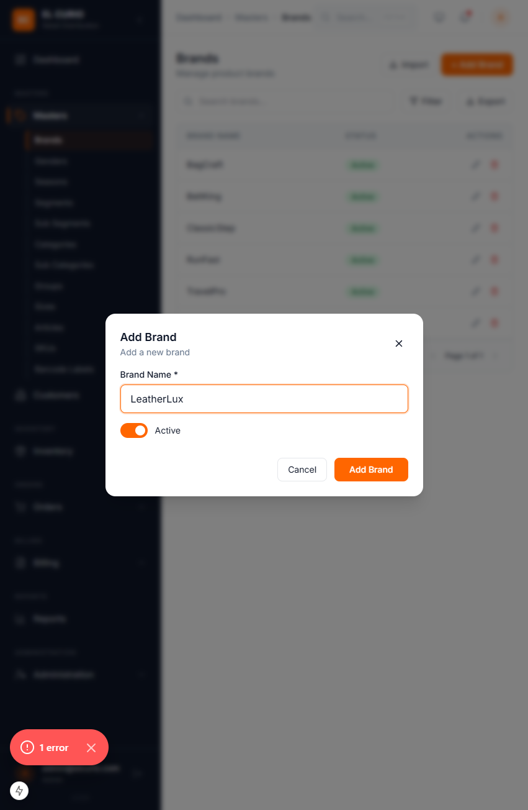

4. Enter the **Brand Name** (e.g., "LeatherLux").
5. Set the **Active** toggle to ON (enabled by default).
6. Click **Save** to create the brand.
7. The modal closes and the brand list refreshes to show the new entry.

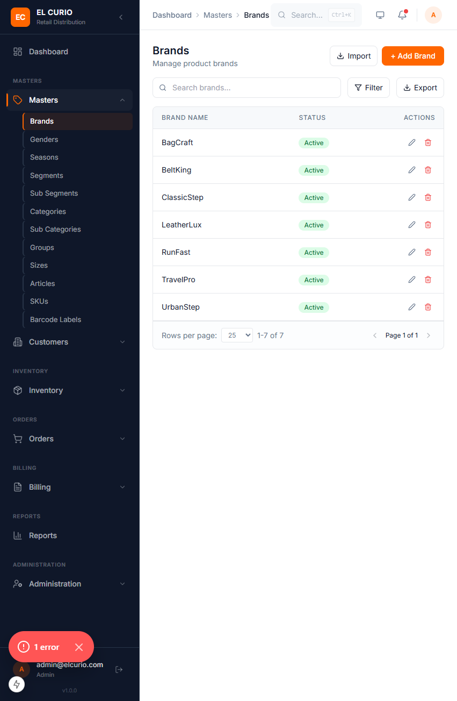

After adding "LeatherLux", the list now shows 7 brands in alphabetical order.

**How to Edit a Brand**

1. Navigate to **Dashboard > Masters > Brands**.
2. Locate the brand you want to edit in the list.
3. Click the **Edit** icon (pencil) on that brand's row, or click directly on the brand row.
4. The edit modal opens with the current values pre-filled.
5. Modify the **Brand Name** or toggle the **Active** status as needed.
6. Click **Save** to apply changes.

**How to Delete a Brand**

1. Navigate to **Dashboard > Masters > Brands**.
2. Locate the brand you want to delete.
3. Click the **Delete** icon (trash) on that brand's row.
4. A confirmation dialog appears: "Are you sure you want to delete this brand?"
5. Click **Confirm** to proceed or **Cancel** to abort.

> **Note:** Deletion will fail if any articles reference the brand. You must first reassign or remove all articles using that brand before it can be deleted.

---

### 2.2 Genders

**Path:** Dashboard > Masters > Genders

Genders define the target demographic for articles. Each article is assigned a gender classification that affects size chart selection and reporting segmentation.

**List View**

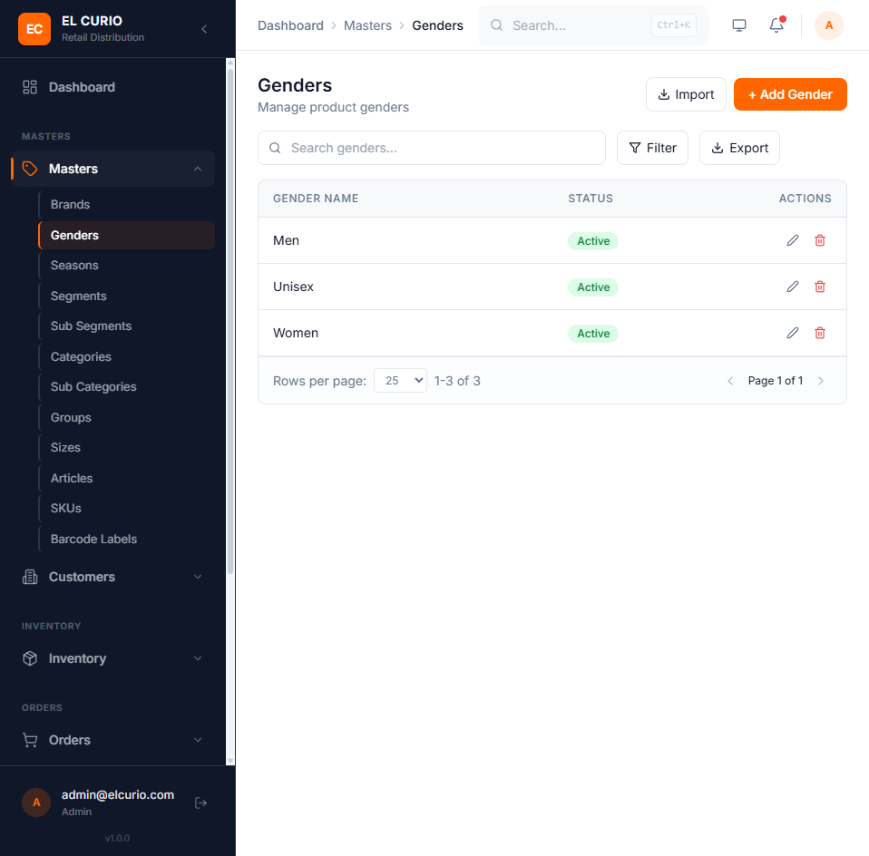

The system currently contains 3 gender records: **Men**, **Unisex**, **Women**.

**Field Descriptions**

| Field | Type | Required | Description |
|-------|------|----------|-------------|
| Gender Name | Text | Yes | The gender classification label (e.g., "Men", "Women", "Unisex"). Must be unique. |
| Active | Toggle | Yes | Whether the gender is available for selection in article creation. |

**How to Add a Gender**

1. Navigate to **Dashboard > Masters > Genders**.
2. Click the **"+ Add Gender"** button.
3. Enter the **Gender Name** (e.g., "Kids").
4. Set the **Active** toggle.
5. Click **Save**.

**How to Edit a Gender**

1. Click the **Edit** icon on the gender row you want to modify.
2. Update the **Gender Name** or **Active** toggle.
3. Click **Save**.

**How to Delete a Gender**

1. Click the **Delete** icon on the gender row.
2. Confirm the deletion in the dialog.
3. Deletion will fail if articles reference this gender.

---

### 2.3 Seasons

**Path:** Dashboard > Masters > Seasons

Seasons represent the seasonal collections under which articles are grouped for buying cycles, production planning, and sales tracking. Each season has a defined date range.

**List View**

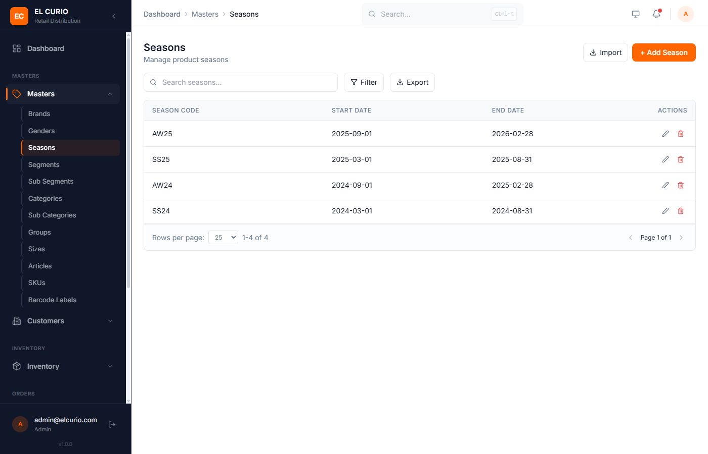

The system currently contains 4 season records: **AW25** (Autumn/Winter 2025), **SS25** (Spring/Summer 2025), **AW24** (Autumn/Winter 2024), **SS24** (Spring/Summer 2024).

**Field Descriptions**

| Field | Type | Required | Description |
|-------|------|----------|-------------|
| Season Code | Text | Yes | A short unique identifier for the season (e.g., "SS25" for Spring/Summer 2025, "AW24" for Autumn/Winter 2024). Typically follows the format: season abbreviation + year. |
| Start Date | Date | Yes | The date when the season officially begins. Used for filtering and reporting. |
| End Date | Date | Yes | The date when the season ends. Must be after the Start Date. |

**How to Add a Season**

1. Navigate to **Dashboard > Masters > Seasons**.
2. Click the **"+ Add Season"** button.
3. Enter the **Season Code** (e.g., "SS26").
4. Select the **Start Date** using the date picker (e.g., 2026-01-01).
5. Select the **End Date** using the date picker (e.g., 2026-06-30).
6. Click **Save**.

**How to Edit a Season**

1. Click the **Edit** icon on the season row.
2. Modify the **Season Code**, **Start Date**, or **End Date**.
3. Click **Save**.

> **Note:** Changing a season code after articles have been assigned to it will not retroactively update those articles. Exercise caution when editing seasons that are already in use.

**How to Delete a Season**

1. Click the **Delete** icon on the season row.
2. Confirm the deletion.
3. Seasons referenced by articles cannot be deleted.

---

### 2.4 Segments

**Path:** Dashboard > Masters > Segments

Segments represent the primary product line divisions of your business. They define the broadest classification of what you sell and are used to organize articles, drive reporting, and determine applicable attributes.

**List View**

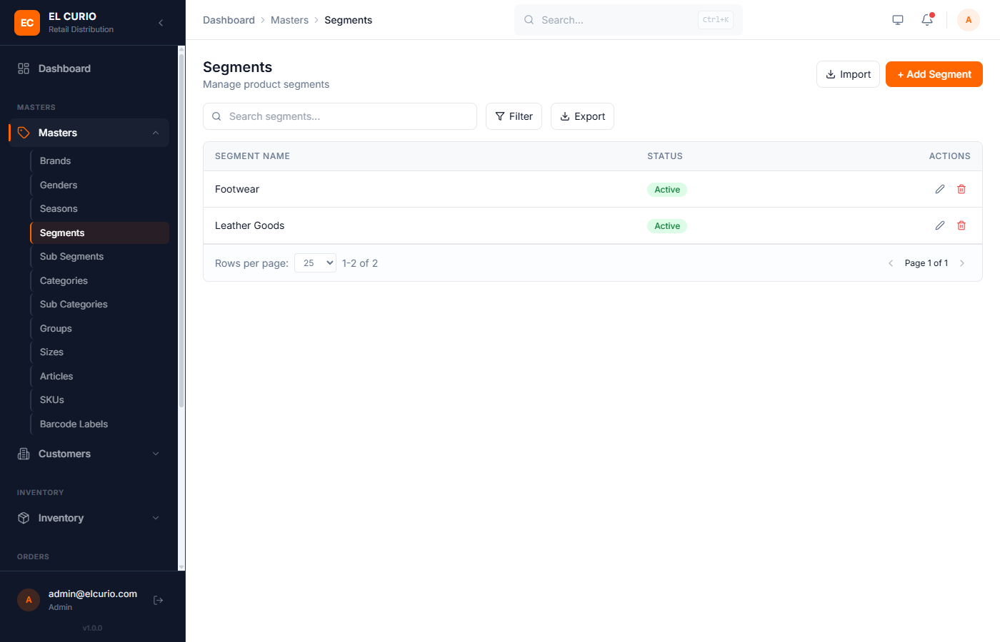

The system currently contains 2 segment records: **Footwear**, **Leather Goods**.

**Field Descriptions**

| Field | Type | Required | Description |
|-------|------|----------|-------------|
| Segment Name | Text | Yes | The name of the product segment (e.g., "Footwear", "Leather Goods"). Must be unique. |
| Active | Toggle | Yes | Whether the segment is available for selection. |

**How to Add a Segment**

1. Navigate to **Dashboard > Masters > Segments**.
2. Click the **"+ Add Segment"** button.
3. Enter the **Segment Name** (e.g., "Accessories").
4. Set the **Active** toggle.
5. Click **Save**.

**How to Edit a Segment**

1. Click the **Edit** icon on the segment row.
2. Update the **Segment Name** or **Active** toggle.
3. Click **Save**.

**How to Delete a Segment**

1. Click the **Delete** icon on the segment row.
2. Confirm the deletion.
3. Segments that have sub-segments or articles referencing them cannot be deleted. Remove or reassign dependent records first.

---

### 2.5 Sub Segments

**Path:** Dashboard > Masters > Sub Segments

Sub Segments provide a second level of classification within a parent Segment. For example, under "Footwear" you might have sub segments like "Formal", "Casual", and "Sports". Under "Leather Goods" you might have "Travel" and "Fashion".

**List View**

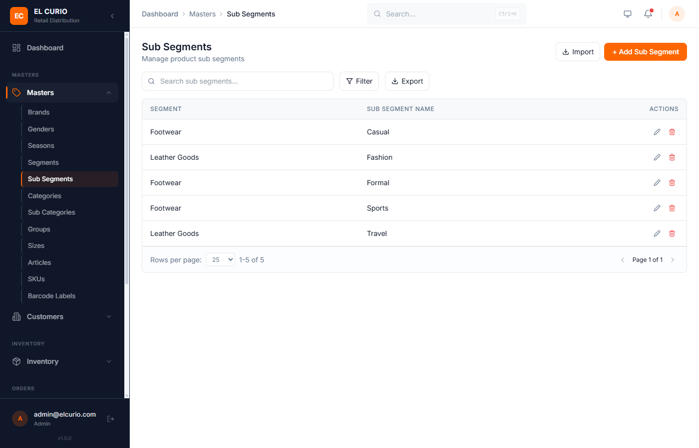

The system currently contains 5 sub segment records: **Casual** (Footwear), **Fashion** (Leather Goods), **Formal** (Footwear), **Sports** (Footwear), **Travel** (Leather Goods).

**Field Descriptions**

| Field | Type | Required | Description |
|-------|------|----------|-------------|
| Parent Segment | Dropdown | Yes | The parent segment this sub segment belongs to. Select from existing active segments (e.g., Footwear, Leather Goods). |
| Sub Segment Name | Text | Yes | The name of the sub segment (e.g., "Formal", "Casual", "Sports"). Must be unique within its parent segment. |

The system currently contains 5 sub segment records.

**How to Add a Sub Segment**

1. Navigate to **Dashboard > Masters > Sub Segments**.
2. Click the **"+ Add Sub Segment"** button.
3. Select the **Parent Segment** from the dropdown (e.g., "Footwear").
4. Enter the **Sub Segment Name** (e.g., "Outdoor").
5. Click **Save**.

**How to Edit a Sub Segment**

1. Click the **Edit** icon on the sub segment row.
2. Change the **Parent Segment** or **Sub Segment Name**.
3. Click **Save**.

**How to Delete a Sub Segment**

1. Click the **Delete** icon on the sub segment row.
2. Confirm the deletion.
3. Sub segments referenced by articles cannot be deleted.

---

### 2.6 Categories

**Path:** Dashboard > Masters > Categories

Categories define the product type classification. While Segments describe the product line (what business division), Categories describe the physical product type (what the item is).

**List View**

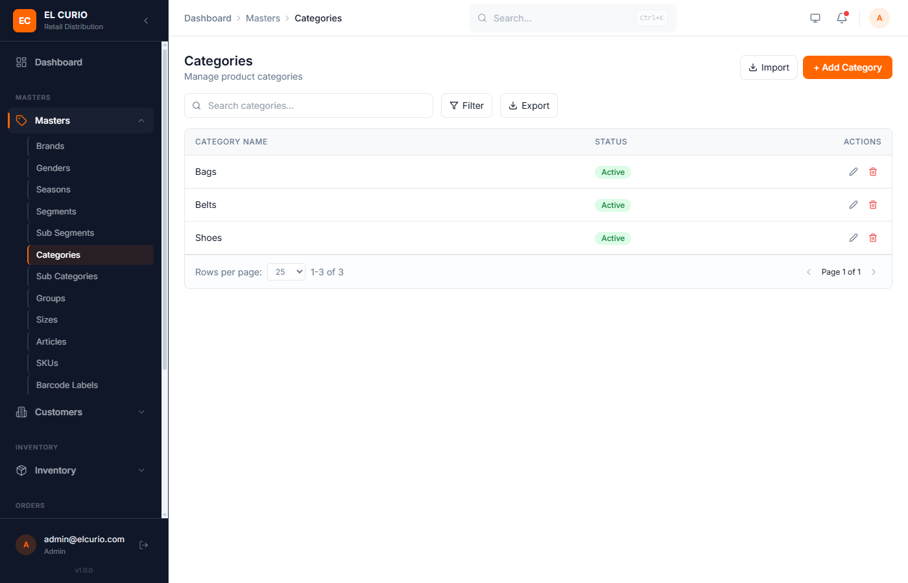

The system currently contains 3 category records: **Bags**, **Belts**, **Shoes**.

**Field Descriptions**

| Field | Type | Required | Description |
|-------|------|----------|-------------|
| Category Name | Text | Yes | The product type name (e.g., "Shoes", "Bags", "Belts"). Must be unique. |
| Active | Toggle | Yes | Whether the category is available for selection. |

**How to Add a Category**

1. Navigate to **Dashboard > Masters > Categories**.
2. Click the **"+ Add Category"** button.
3. Enter the **Category Name** (e.g., "Wallets").
4. Set the **Active** toggle.
5. Click **Save**.

**How to Edit a Category**

1. Click the **Edit** icon on the category row.
2. Update the **Category Name** or **Active** toggle.
3. Click **Save**.

**How to Delete a Category**

1. Click the **Delete** icon on the category row.
2. Confirm the deletion.
3. Categories that have sub categories or articles cannot be deleted until those dependent records are removed or reassigned.

---

### 2.7 Sub Categories

**Path:** Dashboard > Masters > Sub Categories

Sub Categories provide detailed product type classification within a parent Category. For example, under "Shoes" you might have Derby, Oxford, Loafer, and Sneaker. Under "Bags" you might have Backpack, Duffle, and Laptop Bag. Under "Belts" you might have Casual Belt and Formal Belt.

**List View**

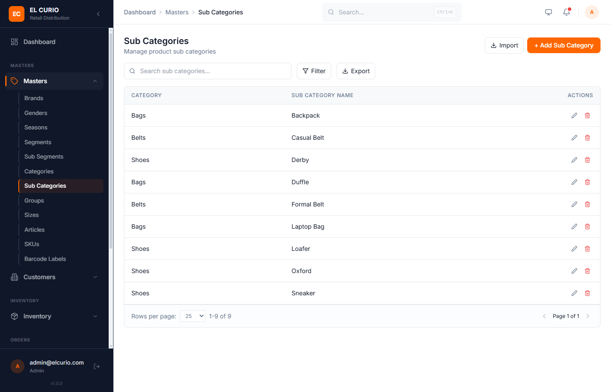

The system currently contains 9 sub category records across the three categories.

**Field Descriptions**

| Field | Type | Required | Description |
|-------|------|----------|-------------|
| Parent Category | Dropdown | Yes | The parent category this sub category belongs to. Select from existing active categories (e.g., Shoes, Bags, Belts). |
| Sub Category Name | Text | Yes | The name of the sub category (e.g., "Derby", "Oxford", "Loafer"). Must be unique within its parent category. |

The system currently contains 9 sub category records across the three categories.

**Example Sub Categories:**

| Parent Category | Sub Categories |
|----------------|----------------|
| Shoes | Derby, Oxford, Loafer, Sneaker |
| Bags | Backpack, Duffle, Laptop Bag |
| Belts | Casual Belt, Formal Belt |

**How to Add a Sub Category**

1. Navigate to **Dashboard > Masters > Sub Categories**.
2. Click the **"+ Add Sub Category"** button.
3. Select the **Parent Category** from the dropdown (e.g., "Shoes").
4. Enter the **Sub Category Name** (e.g., "Monk Strap").
5. Click **Save**.

**How to Edit a Sub Category**

1. Click the **Edit** icon on the sub category row.
2. Change the **Parent Category** or **Sub Category Name**.
3. Click **Save**.

**How to Delete a Sub Category**

1. Click the **Delete** icon on the sub category row.
2. Confirm the deletion.
3. Sub categories referenced by articles cannot be deleted.

---

### 2.8 Groups

**Path:** Dashboard > Masters > Groups

Groups represent design families or collections that tie related products together. A group helps organize articles by their design lineage, allowing buyers to see related products as a cohesive collection.

**List View**

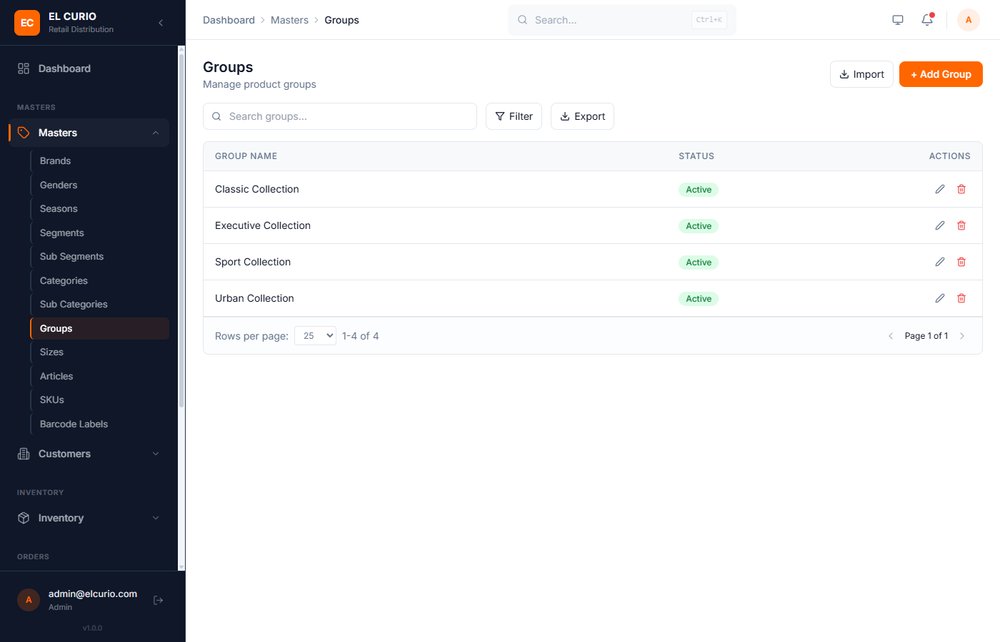

The system currently contains 4 group records: **Classic Collection**, **Executive Collection**, **Sport Collection**, **Urban Collection**.

**Field Descriptions**

| Field | Type | Required | Description |
|-------|------|----------|-------------|
| Group Name | Text | Yes | The collection or design family name (e.g., "Classic Collection", "Executive Collection", "Sport Collection", "Urban Collection"). Must be unique. |
| Active | Toggle | Yes | Whether the group is available for selection in article creation. |

**How to Add a Group**

1. Navigate to **Dashboard > Masters > Groups**.
2. Click the **"+ Add Group"** button.
3. Enter the **Group Name** (e.g., "Heritage Collection").
4. Set the **Active** toggle.
5. Click **Save**.

**How to Edit a Group**

1. Click the **Edit** icon on the group row.
2. Update the **Group Name** or **Active** toggle.
3. Click **Save**.

**How to Delete a Group**

1. Click the **Delete** icon on the group row.
2. Confirm the deletion.
3. Groups referenced by articles cannot be deleted.

---

### 2.9 Sizes

**Path:** Dashboard > Masters > Sizes

The Sizes module manages the size conversion chart used across the platform. This is especially important for footwear, where sizes must be expressed in multiple standards (US, Euro, UK, Indian) and vary by gender and age group.

The size chart interface features **tabs** for different gender/age group combinations (Men, Women, Kids, etc.). Each tab displays the applicable size range with conversion values.

**Field Descriptions**

| Field | Type | Required | Description |
|-------|------|----------|-------------|
| US Size | Text/Number | Yes | The United States size standard value (e.g., 7, 7.5, 8). |
| Euro Size | Number | Yes | The European size standard value (e.g., 39, 40, 41, 42). |
| UK Size | Text/Number | Yes | The United Kingdom size standard value (e.g., 6, 6.5, 7). |
| IND Size | Text/Number | Yes | The Indian size standard value (typically matches UK sizing). |
| Inches | Decimal | No | Foot length in inches for this size. |
| CM | Decimal | No | Foot length in centimeters for this size. |

**Size Conversion Reference (Men's Footwear)**

| Euro | UK | US (Men) | Indian | Inches | CM |
|------|----|----------|--------|--------|-----|
| 38 | 5 | 6 | 5 | 9.69 | 24.6 |
| 39 | 5.5 | 6.5 | 5.5 | 9.88 | 25.1 |
| 40 | 6 | 7 | 6 | 10.00 | 25.4 |
| 41 | 7 | 8 | 7 | 10.25 | 26.0 |
| 42 | 8 | 9 | 8 | 10.50 | 26.7 |
| 43 | 9 | 10 | 9 | 10.75 | 27.3 |
| 44 | 10 | 11 | 10 | 11.00 | 27.9 |
| 45 | 11 | 12 | 11 | 11.25 | 28.6 |

**How to Add a Size Entry**

1. Navigate to **Dashboard > Masters > Sizes**.
2. Select the appropriate **tab** for the gender/age group (e.g., Men).
3. Click the **"+ Add Size"** button.
4. Fill in all size standard values (US, Euro, UK, IND).
5. Optionally enter Inches and CM measurements.
6. Click **Save**.

**How to Edit a Size Entry**

1. Select the appropriate gender/age group tab.
2. Click the **Edit** icon on the size row.
3. Modify the values as needed.
4. Click **Save**.

**How to Delete a Size Entry**

1. Click the **Delete** icon on the size row.
2. Confirm the deletion.
3. Sizes that are part of active SKU records cannot be deleted.

---

### 2.10 Articles

**Path:** Dashboard > Masters > Articles

Articles are the central product master of RetailERP. Each article represents a unique product style/color combination in your catalog. Articles tie together all master data (brand, segment, category, gender, season, group) and serve as the foundation for orders, inventory, production, and billing.

**Field Descriptions**

| Field | Type | Required | Description |
|-------|------|----------|-------------|
| Article Code | Text | Yes | Unique product identifier code (e.g., "ART-001", "SC-BLK-001"). |
| Article Name | Text | Yes | Descriptive product name (e.g., "Classic Derby Black"). |
| Brand | Dropdown | Yes | Select from registered brands (e.g., ClassicStep, UrbanStep). |
| Segment | Dropdown | Yes | Product line segment (Footwear or Leather Goods). |
| Sub Segment | Dropdown | No | Detailed segment classification (e.g., Formal, Casual). |
| Category | Dropdown | Yes | Product type (Shoes, Bags, or Belts). |
| Sub Category | Dropdown | No | Detailed product type (e.g., Derby, Oxford, Loafer). |
| Gender | Dropdown | Yes | Target gender (Men, Women, or Unisex). |
| Season | Dropdown | No | Seasonal collection (e.g., SS25, AW25). |
| Group | Dropdown | No | Design family (e.g., Classic, Executive, Sport). |
| Color | Text | Yes | Product color description (e.g., "Black", "Tan", "Brown"). |
| HSN Code | Text | Yes | Harmonized System Nomenclature code for GST classification (e.g., "6403" for leather footwear). |
| MRP | Number | Yes | Maximum Retail Price in INR. |
| CBD | Number | No | Cost Breakdown -- internal cost used for margin calculations. |
| UOM | Dropdown | Yes | Unit of Measure (default: PAIRS for footwear, PCS for bags/belts). |
| Style | Text | No | Internal style reference. |
| Fastener | Text | No | Closure type (Lace-up, Slip-on, Buckle, Zip, etc.). |
| Launch Date | Date | No | Planned market launch date. |
| Image URL | Text | No | URL to the product image for display in the catalog. |
| Active | Toggle | Yes | Whether the article is available for ordering. |

**Footwear-Specific Fields** (shown when Segment = Footwear):

| Field | Type | Description |
|-------|------|-------------|
| Last | Text | Shoe last/mold identifier used in production. |
| Upper Leather | Text | Type of leather for the shoe upper (e.g., "Full Grain", "Nappa"). |
| Lining Leather | Text | Type of leather for the shoe lining. |
| Sole | Text | Sole type and material (e.g., "Leather", "TPR", "Rubber"). |
| Size Run From | Number | Starting Euro size for this article. |
| Size Run To | Number | Ending Euro size for this article. |

**Leather Goods-Specific Fields** (shown when Segment = Leather Goods):

| Field | Type | Description |
|-------|------|-------------|
| Dimensions | Text | Product dimensions (L x W x H). |
| Security Features | Text | Security features (locks, RFID blocking, etc.). |

**How to Add an Article**

1. Navigate to **Dashboard > Masters > Articles**.
2. Click **"+ New Article"**.
3. Fill in all required fields starting with Article Code and Name.
4. Select the Brand, Segment, Category, and Gender from their respective dropdowns.
5. Optionally select Sub Segment, Sub Category, Season, and Group.
6. Enter Color, HSN Code, and MRP.
7. For footwear, fill in the shoe-specific fields (Last, Upper Leather, Lining Leather, Sole, Size Run).
8. For leather goods, fill in Dimensions and Security Features.
9. Click **Save** to create the article.
10. After saving, proceed to add size variants and SKUs.

**How to Edit an Article**

1. Locate the article in the list using search or filters.
2. Click the **Edit** icon on the article row.
3. Modify any fields as needed.
4. Click **Save** to apply changes.

**How to Delete an Article**

1. Click the **Delete** icon on the article row.
2. Confirm the deletion.
3. Articles with existing inventory, orders, or invoices cannot be deleted. Deactivate them instead by setting Active to OFF.

**Filtering Articles**

The articles list supports extensive filtering:
- **Brand** -- Filter by one or more brands
- **Segment** -- Filter by product line
- **Category** -- Filter by product type
- **Gender** -- Filter by target demographic
- **Season** -- Filter by collection season
- **Active** -- Show active, inactive, or all articles
- **Search** -- Free-text search across article code and name

---

### 2.11 SKUs

**Path:** Dashboard > Masters > SKUs

SKUs (Stock Keeping Units) represent the most granular level of product identification. Each SKU is a unique combination of Article + Size and is automatically generated when size variants are added to an article.

**Key Features:**

- **Auto-generated Barcodes** -- Each SKU receives a unique barcode for warehouse scanning and inventory tracking.
- **EAN Codes** -- European Article Number codes are generated for retail point-of-sale compatibility.
- **Size-specific MRP** -- Each SKU can have a size-specific MRP override if pricing varies by size.

**Field Descriptions**

| Field | Type | Description |
|-------|------|-------------|
| SKU Code | Text (Auto) | Automatically generated unique identifier combining article code and size. |
| Article | Reference | The parent article this SKU belongs to. |
| Euro Size | Number | The European size of this variant. |
| UK Size | Number | The UK size equivalent. |
| US Size | Number | The US size equivalent. |
| EAN Code | Text (Auto) | Auto-generated European Article Number for barcode scanning. |
| Barcode | Image (Auto) | Visual barcode generated from the EAN code. |
| MRP | Number | Price for this specific size variant (defaults to article MRP). |

**How to Add SKUs**

SKUs are typically created through the Article detail page by adding size variants:

1. Open an article in edit mode.
2. Navigate to the **Sizes** tab or section.
3. Click **"+ Add Size"**.
4. Select the **Euro Size** from the size chart.
5. The UK, US, and Indian sizes are auto-populated from the size conversion chart.
6. Enter a size-specific MRP if different from the article MRP.
7. Click **Save**. The system generates the EAN code and barcode automatically.

**How to Edit an SKU**

1. Open the parent article.
2. Locate the size variant in the sizes section.
3. Modify the MRP or other editable fields.
4. Click **Save**.

**How to Delete an SKU**

1. Open the parent article.
2. Click the **Delete** icon next to the size variant.
3. Confirm the deletion.
4. SKUs with inventory or order history cannot be deleted.

---

## 3. Customer Management

The Customers module manages the B2B client relationships and their retail store locations. Clients represent the business entities you sell to, while Stores represent the physical retail locations where goods are delivered.

---

### 3.1 Clients

**Path:** Dashboard > Customers > Clients

Clients are your B2B distribution partners -- retail chains, distributors, and individual retailers who purchase goods from you.

**List View**

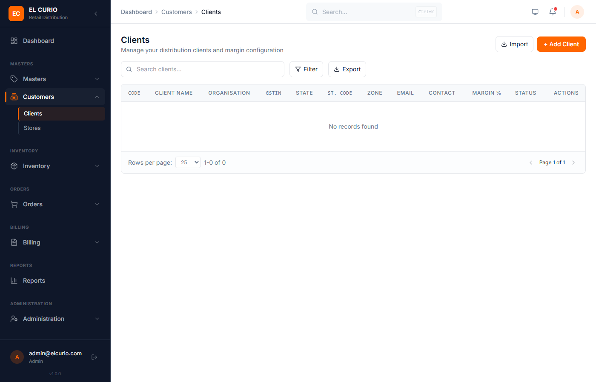

The Clients list displays all registered clients in a searchable, paginated table with columns for Code, Client Name, Organisation, GSTIN, State, Zone, Email, Contact, Margin %, and Status.

**Field Descriptions**

| Field | Type | Required | Description |
|-------|------|----------|-------------|
| Client Code | Text | Yes | Unique identifier for the client (e.g., "CLI-001"). |
| Client Name | Text | Yes | Business/trade name of the client. |
| Organisation | Text | Yes | Legal entity name (as per GST registration). |
| GSTIN | Text (15 chars) | Yes | GST Identification Number. Validated for format: 2-digit state code + 10-digit PAN + 1 entity + 1 check digit + "Z". |
| PAN | Text (10 chars) | Yes | Permanent Account Number for income tax. |
| State | Dropdown | Yes | Indian state of registration. Determines GST type (intra-state vs. inter-state). |
| Zone | Dropdown | Yes | Geographic sales zone (North, South, East, West, Central). Used for sales territory reporting. |
| Email | Email | Yes | Primary contact email address. |
| Contact No | Text | Yes | Primary phone number. |
| Margin % | Number | Yes | Default trade margin percentage applied to MRP for this client (e.g., 35 means 35% discount on MRP). |
| Margin Type | Dropdown | Yes | How the margin is calculated: **"NET OF TAXES"** (margin applied before tax) or **"ON MRP"** (margin applied on MRP directly). |

**How to Add a Client**

1. Navigate to **Dashboard > Customers > Clients**.
2. Click the **"+ Add Client"** button.
3. Fill in all required fields. Pay special attention to:
   - **GSTIN** -- Must be a valid 15-character GST number.
   - **State** -- Must match the state code in the GSTIN.
   - **Margin %** -- This becomes the default margin for all orders to this client.
   - **Margin Type** -- Choose the margin calculation method agreed with the client.
4. Click **Save**.

**How to Edit a Client**

1. Click the **Edit** icon on the client row.
2. Modify fields as needed. Changing Margin % or Margin Type will affect future orders but not existing ones.
3. Click **Save**.

**How to Delete a Client**

1. Click the **Delete** icon on the client row.
2. Confirm the deletion. This performs a soft delete -- the client is deactivated but historical data is preserved.
3. Clients with active orders or unpaid invoices cannot be deleted.

---

### 3.2 Stores (Customer Master Entry)

**Path:** Dashboard > Customers > Stores

Stores represent the physical retail locations belonging to your clients. Each client can have multiple stores. Stores carry their own tax registration, address, and operational details, which are used for invoice generation and logistics.

**List View**

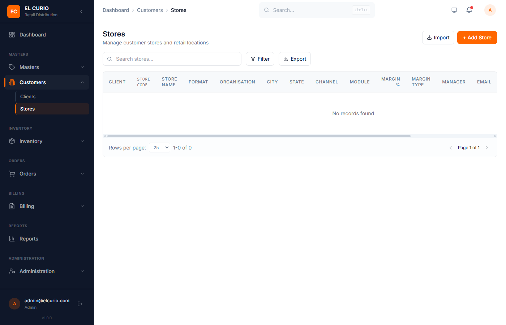

The Stores list displays all registered stores in a wide, horizontally scrollable table with columns for Client, Store Code, Store Name, Format, Organisation, City, State, Channel, Module, Margin %, Margin Type, Manager, Email, GSTIN, PAN, and Status.

**Field Descriptions**

| Field | Type | Required | Description |
|-------|------|----------|-------------|
| Store Code | Text | Yes | Unique store identifier (e.g., "STR-001"). |
| Store Name | Text | Yes | Display name of the store (e.g., "Fashion Hub - Connaught Place"). |
| Client | Dropdown | Yes | The parent client this store belongs to. |
| Format | Dropdown | Yes | Store format: **RETAIL_MALL** (shopping mall), **RETAIL_HIGH_STREET** (standalone high-street), or **OUTLET** (factory outlet/discount store). |
| Channel | Dropdown | Yes | Sales channel: **MBO** (Multi-Brand Outlet), **EBO** (Exclusive Brand Outlet), or **DISTRIBUTOR** (wholesale distribution). |
| Modus Operandi | Dropdown | Yes | Business model: **SOR** (Sale or Return -- consignment basis) or **OUT_MKT** (Outright Market -- firm sale). |
| Margin % | Number | No | Store-level margin override. If set, this overrides the client-level margin for orders to this store. |
| Billing Address | Text | Yes | Full billing address including street, landmark, city, state, and PIN code. Printed on invoices. |
| Shipping Address | Text | Yes | Full shipping/delivery address. May differ from billing address. Printed on packing lists and delivery notes. |
| City | Text | Yes | City where the store is located. |
| State | Dropdown | Yes | State where the store is located. Critical for GST determination. |
| GSTIN | Text | Yes | Store-level GST number (may differ from client GSTIN for multi-state operations). |
| PAN | Text | Yes | Store-level PAN number. |
| Manager Name | Text | No | Name of the store manager for delivery coordination. |
| Manager Contact | Text | No | Store manager phone number. |

**How to Add a Store**

1. Navigate to **Dashboard > Customers > Stores**.
2. Click the **"+ Add Store"** button.
3. Select the **Client** from the dropdown. The client's details are used as defaults.
4. Enter the **Store Code** and **Store Name**.
5. Select the **Format**, **Channel**, and **Modus Operandi**.
6. Enter both **Billing Address** and **Shipping Address** carefully -- these appear on invoices and shipping labels.
7. Enter the store's **GSTIN** and **State** -- these determine whether IGST or CGST+SGST is applied.
8. Optionally set a **Margin %** override.
9. Click **Save**.

**How to Edit a Store**

1. Click the **Edit** icon on the store row.
2. Modify fields as needed.
3. Click **Save**.

**How to Delete a Store**

1. Click the **Delete** icon on the store row.
2. Confirm the deletion (soft delete).
3. Stores with order or invoice history cannot be hard-deleted.

---

## 4. Inventory Management

The Inventory module provides complete warehouse stock management including real-time stock tracking, goods receipt, dispatch, returns processing, stock adjustments, and period-end stock freezing.

---

### 4.1 Stock Overview

**Path:** Dashboard > Inventory > Stock Overview

The Stock Overview is a monthly stock ledger that displays the current stock position across all warehouses and articles. It tracks 9 movement groups that affect stock quantities.

**Stock Movement Groups**

| # | Movement Group | Direction | Description |
|---|---------------|-----------|-------------|
| 1 | Opening Stock | -- | Carried forward from previous period's closing stock |
| 2 | Purchase/Receipt | Inward | Goods received from suppliers or production |
| 3 | Production Inward | Inward | Finished goods received from production |
| 4 | Sales Dispatch | Outward | Goods dispatched against customer orders |
| 5 | Customer Returns | Inward | Goods returned by customers |
| 6 | Supplier Returns | Outward | Goods returned to suppliers |
| 7 | Adjustment (Add) | Inward | Stock corrections -- additions |
| 8 | Adjustment (Remove) | Outward | Stock corrections -- removals |
| 9 | Closing Stock | -- | Calculated: Opening + All Inward - All Outward |

**Key Columns**

| Column | Description |
|--------|-------------|
| Article Code | Unique product identifier |
| Article Name | Product description |
| Category | Product category (Shoes, Bags, Belts) |
| Opening Qty | Stock at the beginning of the period |
| Receive Qty | Total goods received during the period |
| Issue Qty | Total goods issued/dispatched during the period |
| Return Qty | Total goods returned during the period |
| Closing Qty | Current available stock quantity |
| Opening Value | Monetary value at period start |
| Closing Value | Current stock monetary value |

**Features:**
- **Warehouse Filter** -- Select a specific warehouse or view consolidated stock across all warehouses.
- **Search** -- Find articles by code or name.
- **Expandable Rows** -- Click any article row to reveal size-wise stock breakdown.
- **Frozen Indicator** -- A lock icon indicates stock that has been frozen for period-end closing and cannot be modified.
- **Export** -- Download the current stock data as a CSV file.

---

### 4.2 Stock Receipt (GRN)

**Path:** Dashboard > Inventory > Receipt (GRN)

Record incoming goods into the warehouse using a Goods Received Note (GRN). The receipt interface uses a size-run chart for efficient data entry.

**How to Record a Stock Receipt**

1. Navigate to **Dashboard > Inventory > Receipt (GRN)**.
2. Select the **Warehouse** receiving the goods.
3. Select the **Article** being received. The system loads the article's size run automatically.
4. A **size-run chart** appears showing all applicable sizes in a grid:

   | Euro 39 | Euro 40 | Euro 41 | Euro 42 | Euro 43 | Euro 44 | Total |
   |---------|---------|---------|---------|---------|---------|-------|
   | ___ | ___ | ___ | ___ | ___ | ___ | 0 |

5. Enter the **quantity received** for each size in the grid cells.
6. The **Total** column updates automatically as you type.
7. Enter the **Reference Number** (e.g., Purchase Order number, supplier invoice number).
8. Add any **Notes** about the shipment (condition, partial delivery, etc.).
9. Click **Save** to record the receipt.

The stock ledger is updated immediately with the inward quantities.

---

### 4.3 Dispatch

**Path:** Dashboard > Inventory > Dispatch

Record outward movement of goods from the warehouse, typically for customer orders.

**How to Dispatch Stock**

1. Navigate to **Dashboard > Inventory > Dispatch**.
2. Select the **Warehouse** dispatching the goods.
3. Select the **Order** or enter reference details manually.
4. Enter **size-wise quantities** being dispatched.
5. The system shows **available stock** per size in real-time -- you cannot dispatch more than available.
6. Enter transport/logistics reference details.
7. Click **Save** to record the dispatch.

---

### 4.4 Returns

**Path:** Dashboard > Inventory > Returns

Process customer returns back into warehouse inventory.

**How to Process a Return**

1. Navigate to **Dashboard > Inventory > Returns**.
2. Select the **Warehouse** receiving the return.
3. Enter the **Return Reference** (original invoice or order number).
4. Select the **Article** being returned.
5. Enter **size-wise return quantities**.
6. Select the **Return Reason** from the dropdown (e.g., Defective, Wrong Size, Customer Cancellation, Damaged in Transit).
7. Add any notes about the condition of returned goods.
8. Click **Save** to update the stock ledger.

---

### 4.5 Stock Adjustment

**Path:** Dashboard > Inventory > Adjustment

Create adjustments to correct stock discrepancies discovered during physical counts, or to account for damaged, lost, or expired goods.

**Adjustment Types:**
- **ADD** -- Increase stock (found extra inventory during physical count, correction of prior error)
- **REMOVE** -- Decrease stock (damaged goods, lost items, expired stock, correction of prior error)

**How to Create a Stock Adjustment**

1. Navigate to **Dashboard > Inventory > Adjustment**.
2. Click **"+ New Adjustment"**.
3. Select the **Warehouse**.
4. Select the **Article** and enter **size-wise quantities**.
5. Select the **Adjustment Type** (ADD or REMOVE).
6. Enter a detailed **Reason** for the adjustment.
7. Click **Save**. The adjustment is created in **DRAFT** status.
8. Submit the adjustment for approval.
9. An authorized user (Admin or Manager) **approves** the adjustment.
10. Upon approval, the stock ledger is updated.

**Adjustment Status Flow:**

```
DRAFT --> SUBMITTED --> APPROVED --> (Stock Updated)
                  |
                  +--> CANCELLED
```

---

### 4.6 Stock Transactions

**Path:** Dashboard > Inventory > Transactions

View the complete chronological history of all stock movements across the system.

**Filter Options:**
- **Article** -- Filter by specific product
- **Warehouse** -- Filter by warehouse
- **Date Range** -- Filter by time period
- **Movement Type** -- OPENING, PURCHASE, PRODUCTION, SALES, RETURN, ADJUSTMENT
- **Direction** -- INWARD or OUTWARD

---

### 4.7 Stock Freeze

**Path:** Dashboard > Inventory > Stock Freeze

Stock Freeze locks the inventory at a point in time for period-end closing. This ensures that closing stock values are preserved for financial reporting and that the closing stock of one period becomes the opening stock of the next.

**How to Freeze Stock**

1. Navigate to **Dashboard > Inventory > Stock Freeze**.
2. Select the **Warehouse** to freeze.
3. Select the **Freeze Date** (typically the last day of the month or quarter).
4. Review the stock summary that the system displays.
5. Click **Freeze** to lock all stock quantities as of that date.
6. The system records the closing stock values and creates opening stock entries for the next period.

**How to Unfreeze Stock**

1. Only users with **Admin** or **Manager** roles can unfreeze stock.
2. Navigate to **Dashboard > Inventory > Stock Freeze**.
3. Locate the frozen period in the list.
4. Click **Unfreeze**.
5. Confirm the action. The stock lock is removed and transactions can be posted to that period again.

> **Warning:** Unfreezing stock after financial reports have been submitted can create discrepancies. Use with caution and document the reason.

---

## 5. Order Management

The Orders module handles the full lifecycle of customer orders -- from creation through fulfillment -- with size-wise quantity tracking at every stage.

---

### 5.1 Customer Orders

**Path:** Dashboard > Orders

Create and manage customer orders with detailed size-wise quantity entry and real-time stock availability checking.

**List View**

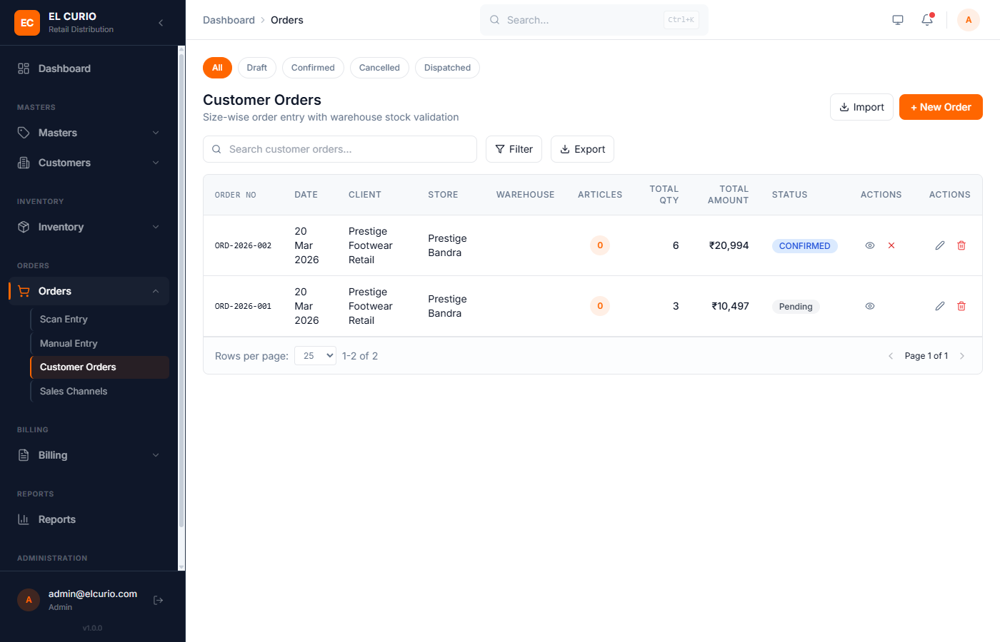

The Customer Orders list displays all orders with status filter tabs (All, Draft, Confirmed, Cancelled, Dispatched) and columns for Order No, Date, Client, Store, Warehouse, Articles, Total Qty, Total Amount, and Status. The system currently contains 2 orders: ORD-2026-001 (Pending) and ORD-2026-002 (Confirmed).

**How to Create a Customer Order**

1. Navigate to **Dashboard > Orders**.
2. Click **"+ New Order"**.
3. Select the **Client** from the dropdown.
4. Select the **Store** (filtered to stores belonging to the selected client).
5. Optionally select the **Warehouse** for real-time stock availability checking.
6. The system assigns an auto-generated **Order Number**.
7. **Add articles to the order:**
   a. Click **"+ Add Article"**.
   b. Search and select an article from the catalog.
   c. The system displays a **size-wise entry grid**:

   | Euro | UK | Ind | Opening Stock | Order Qty | Closing Stock |
   |------|----|-----|---------------|-----------|---------------|
   | 39 | 5 | 5 | 120 | 20 | 100 |
   | 40 | 6 | 6 | 150 | 30 | 120 |
   | 41 | 7 | 7 | 180 | 40 | 140 |
   | 42 | 8 | 8 | 160 | 35 | 125 |
   | 43 | 9 | 9 | 100 | 25 | 75 |

   d. Enter the **Order Quantity** for each size. The **Closing Stock** column updates in real-time.
   e. Add multiple articles to the same order by repeating steps a-d.
8. Review the order totals: **Total Quantity**, **Total MRP**, **Total Amount** (after margin).
9. Click **Save** to create the order in **DRAFT** status.

**Order Status Flow**

```
DRAFT --> CONFIRMED --> PROCESSING --> DISPATCHED --> DELIVERED
  |          |              |
  +----------+--------------+--------> CANCELLED
```

| Status | Description |
|--------|-------------|
| DRAFT | Order created but not finalized. Can be edited or cancelled. |
| CONFIRMED | Order locked and stock reserved. No further edits. |
| PROCESSING | Warehouse is picking and packing the order. |
| DISPATCHED | Goods have left the warehouse. |
| DELIVERED | Goods received by the customer. |
| CANCELLED | Order cancelled with reason. Stock reservation released. |

**Order Actions:**
- **Confirm** -- Lock the order and reserve stock (DRAFT to CONFIRMED).
- **Cancel** -- Cancel with a mandatory reason (available for DRAFT, CONFIRMED, or PROCESSING orders).
- **Print** -- Generate a printable order summary.

---

### 5.2 Production Orders

**Path:** Dashboard > Production

Create and track production orders for manufacturing footwear, bags, and belts. Production orders specify the article, material details, and size-wise quantities to produce.

**How to Create a Production Order**

1. Navigate to **Dashboard > Production**.
2. Click **"+ New Production Order"**.
3. Select the **Article** to produce.
4. The system auto-fills material specifications from the article master:
   - Group/Collection name
   - Colour
   - Last (shoe last/mold)
   - Upper Leather type
   - Lining Leather type
   - Sole type
5. Select the **Order Type**:
   - **REPLENISHMENT** -- Restocking an existing product
   - **FRESH** -- New product launch production
   - **SAMPLE** -- Sample production run
6. Enter **size-wise quantities** in the production grid.
7. Optionally fill in:
   - Upper Cutting Dies specifications
   - Material Cutting Dies
   - Socks/Insole Cutting Dies
   - Production Notes
8. Click **Save** (creates in DRAFT status).

**Production Order Status Flow**

```
DRAFT --> APPROVED --> IN_PRODUCTION --> COMPLETED
  |          |              |
  +----------+--------------+--------> CANCELLED
```

| Action | Who Can Do It | Description |
|--------|---------------|-------------|
| Create | Any user | Create draft production order |
| Approve | Admin, Manager | Authorize production to begin |
| Start | Warehouse/Production | Move to IN_PRODUCTION status |
| Complete | Warehouse/Production | Record produced quantities per size |
| Cancel | Admin, Manager | Cancel with reason |

**Print Support:** Production orders can be printed for the factory floor, showing all material details and size-wise quantity requirements.

---

### 5.3 Sales Channels

**Path:** Dashboard > Orders > Sales Channels

Configure and manage the sales channels through which orders can be placed and tracked:

| Channel | Description |
|---------|-------------|
| **MBO** | Multi-Brand Outlet -- retail stores carrying multiple brands |
| **EBO** | Exclusive Brand Outlet -- stores dedicated to your brand |
| **Distributor** | Wholesale distribution partners |
| **Online** | E-commerce and digital sales platforms |

Sales channel data is used in reporting to analyze revenue performance by channel.

---

## 6. Billing

The Billing module handles GST-compliant tax invoice generation, packing list creation, and delivery tracking. The system implements the EL CURIO margin formula for automatic price calculation.

---

### 6.1 Tax Invoice and Packing

**Path:** Dashboard > Billing > Invoices

Create GST-compliant tax invoices with automatic margin calculation, tax determination, and print-ready formatting.

**List View**

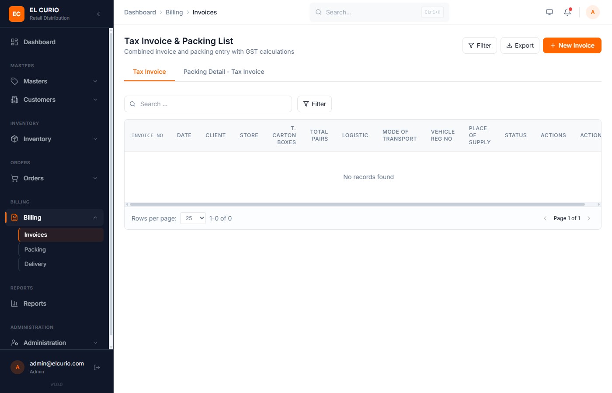

The Invoices page features a tabbed interface with "Tax Invoice" and "Packing Detail - Tax Invoice" views. The table displays Invoice No, Date, Client, Store, T. Carton Boxes, Total Pairs, Logistic, Mode of Transport, Vehicle Reg No, Place of Supply, and Status.

**EL CURIO Margin Formula**

The system applies the following pricing formula:

```
Unit Price = MRP - (MRP x Margin%)
Taxable Amount = Unit Price x Quantity
GST = Taxable Amount x GST Rate

For "NET OF TAXES" margin type:
  Unit Price = MRP x (1 - Margin%) / (1 + GST Rate)

For "ON MRP" margin type:
  Unit Price = MRP x (1 - Margin%)
```

**How to Create a Tax Invoice**

1. Navigate to **Dashboard > Billing > Invoices**.
2. Click **"+ New Invoice"**.
3. Select the **Client** and **Store**.
4. The system auto-populates:
   - **Billing Address** from the Customer Master Entry (Store record)
   - **Shipping Address** from the Store record
   - **GSTIN** details for both seller and buyer
   - **Place of Supply** (state of the buyer)
5. The system automatically determines the **tax type**:
   - **Intra-state** (seller and buyer in the same state): CGST (9%) + SGST (9%)
   - **Inter-state** (seller and buyer in different states): IGST (18%)
6. **Add line items:**
   - Select the **Article** from the catalog.
   - Select the **Size**.
   - Enter the **Quantity**.
   - **MRP** is auto-filled from the article master.
   - **Margin %** is applied automatically from the client/store configuration.
   - **Unit Price** is calculated: MRP - Margin Amount.
   - **Taxable Amount** = Unit Price x Quantity.
   - **GST** is calculated at the applicable rate (default 18% for HSN 64xx).
7. Review the invoice totals:
   - Subtotal (sum of all line items before tax)
   - Total Discount (sum of all margin amounts)
   - Taxable Amount
   - CGST + SGST (intra-state) or IGST (inter-state)
   - Grand Total
   - Round Off
   - Net Payable
8. Click **Save** (creates in DRAFT status).
9. Click **Issue** to finalize the invoice. Once issued, it cannot be edited.

**Invoice Statuses:** DRAFT --> FINALIZED or CANCELLED

**Invoice Types:**

| Type | Description |
|------|-------------|
| TAX_INVOICE | Standard sales invoice for goods sold |
| CREDIT_NOTE | Issued when goods are returned or prices are adjusted downward |
| DEBIT_NOTE | Issued for additional charges or price adjustments upward |

**Additional Fields:**
- **IRN** -- Invoice Reference Number for e-invoicing compliance
- **E-Way Bill Number** -- Required for transporting goods worth more than Rs. 50,000
- **Purchase Order Number/Date** -- Customer's PO reference

---

### 6.2 Print Formats

Invoices and packing lists can be printed in standard GST-compliant format. The printed output includes:

- **Company header** with logo, name, address, GSTIN, and PAN
- **Buyer/consignee details** with full address and GSTIN
- **Article-wise breakdown** with HSN codes, quantities, rates, and amounts
- **Tax bifurcation** showing CGST/SGST or IGST separately per line item and in summary
- **Amount in words** (e.g., "Rupees One Lakh Twenty-Three Thousand Four Hundred Fifty-Six Only")
- **Terms and conditions** as configured in Company Master
- **Packing details** showing carton-wise breakdown (if packing list is linked)
- **Transport details** including vehicle number, LR number, and logistics partner

**Creating a Packing List**

1. Navigate to **Dashboard > Billing > Packing**.
2. Select the **Invoice** to create a packing list for.
3. Enter **Transport Details**:
   - Transport Mode (Road, Air, Rail, Sea)
   - Logistics Partner name
   - Vehicle Number
   - LR (Lorry Receipt) Number and Date
4. Enter **carton-wise packing details**:
   - Carton Number, Article, Size, Quantity per carton
5. The system calculates **Total Cartons** and **Total Pairs**.
6. Click **Save**.

---

## 7. Reports

**Path:** Dashboard > Reports

The Reports module provides 9 different report types in a tabbed interface. All reports support date range filtering, CSV export, and print formatting.

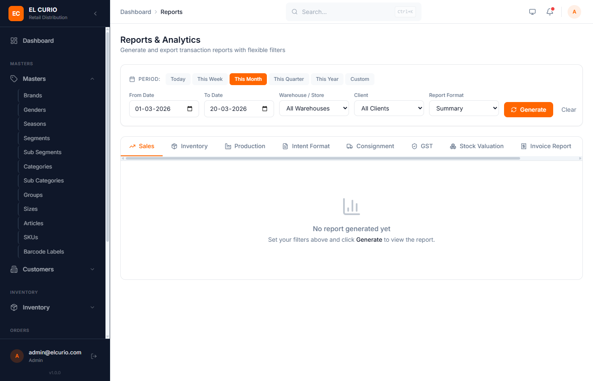

The Reports page features a period selector (Today, This Week, This Month, This Quarter, This Year, Custom) with date range pickers, warehouse/store filter, client filter, and report format selector (Summary/Detailed). Report tabs include: Sales, Inventory, Production, Intent Format, Consignment, GST, Stock Valuation, Invoice Report, and Packing Report.

---

### 7.1 Report Types

| # | Report | Description | Key Filters |
|---|--------|-------------|-------------|
| 1 | **Sales Report** | All customer orders with detailed line items, totals, and status breakdown | Date range, Client, Register/Summary view |
| 2 | **Inventory Report** | Current stock levels with reorder alerts and availability tracking | Warehouse, Low Stock Only toggle |
| 3 | **Production Report** | Production order pipeline with planned vs. actual quantities and dates | Date range, Status |
| 4 | **Intent Report** | Purchase intent and demand analysis for procurement planning | Date range, Segment, Category |
| 5 | **Consignment Report** | Consignment stock tracking for SOR (Sale or Return) business | Client, Warehouse, Date range |
| 6 | **GST Report** | GST compliance data with full tax bifurcation for GSTR-1 and GSTR-3B filing | Date range |
| 7 | **Valuation Report** | Stock valuation at cost and market price for financial reporting | Warehouse, Date |
| 8 | **Invoice Report** | Invoice register with detailed tax breakdowns and payment status | Date range, Client, Status |
| 9 | **Packing Report** | Packing list details organized by invoice for logistics tracking | Date range, Invoice |

### 7.2 Sales Report

**Filters:** Date range, Client
**Views:** Register (detailed line-by-line) or Summary (aggregated totals)

Shows all customer orders with:
- Order number, date, client name, store, status
- Subtotal, discount amount, taxable amount, tax, grand total
- Line count and total quantity per order

### 7.3 Inventory Report

**Filters:** Warehouse, Low Stock Only toggle

Shows current stock levels with:
- Article SKU, size, color
- Quantity on hand, quantity reserved (for confirmed orders), quantity available
- Reorder level and reorder quantity
- Low stock indicator (highlighted when available qty falls below reorder level)

### 7.4 Production Report

**Filters:** Date range, Status

Shows production orders with:
- Production number, article, current status
- Planned start/end dates vs. actual dates
- Total planned quantity, completed quantity, rejected quantity, pending quantity
- Estimated cost vs. actual cost

### 7.5 Intent Report

Purchase intent and demand analysis for procurement planning and forecasting.

### 7.6 Consignment Report

Consignment stock tracking for SOR (Sale or Return) business. Shows stock placed at customer stores on consignment, with aging and sell-through analysis.

### 7.7 GST Report

**Filters:** Date range

GST compliance report showing:
- Invoice number, date, client name, GSTIN
- Inter-state flag (Yes/No)
- Seller state and buyer state
- Taxable amount
- CGST amount, SGST amount, IGST amount
- Total tax and total invoice amount
- Invoice status

This report can be exported as CSV for direct use in GST return filing (GSTR-1, GSTR-3B).

### 7.8 Valuation Report

Stock valuation at cost price and market price, useful for balance sheet reporting and insurance purposes.

### 7.9 Invoice Report

Invoice register with complete details including line items, tax breakdowns, and payment tracking.

### 7.10 Packing Report

Packing list details organized by invoice, showing carton-wise breakdowns and transport information.

### 7.11 Date Range Shortcuts

All date-based reports support quick date range selection:

| Shortcut | Range |
|----------|-------|
| **Today** | Current date only |
| **This Week** | Monday of current week to today |
| **This Month** | First day of current month to today |
| **This Quarter** | First day of current quarter to today |
| **This Year** | January 1 to today |
| **Custom** | Select any start and end date using date pickers |

### 7.12 Exporting Reports

Click the **Download** or **CSV Export** button on any report to download the current filtered data as a CSV file. The file is automatically named with the report type and current date (e.g., `GST-Report-2026-03-20.csv`). CSV files can be opened in Microsoft Excel, Google Sheets, or any spreadsheet application.

---

## 8. Administration

The Administration module provides system configuration, user management, access control, and audit capabilities. Most administration functions are restricted to the Admin role.

---

### 8.1 Users

**Path:** Dashboard > Admin > Users
*Accessible only to Admin role.*

Manage user accounts for your organization.

**List View**

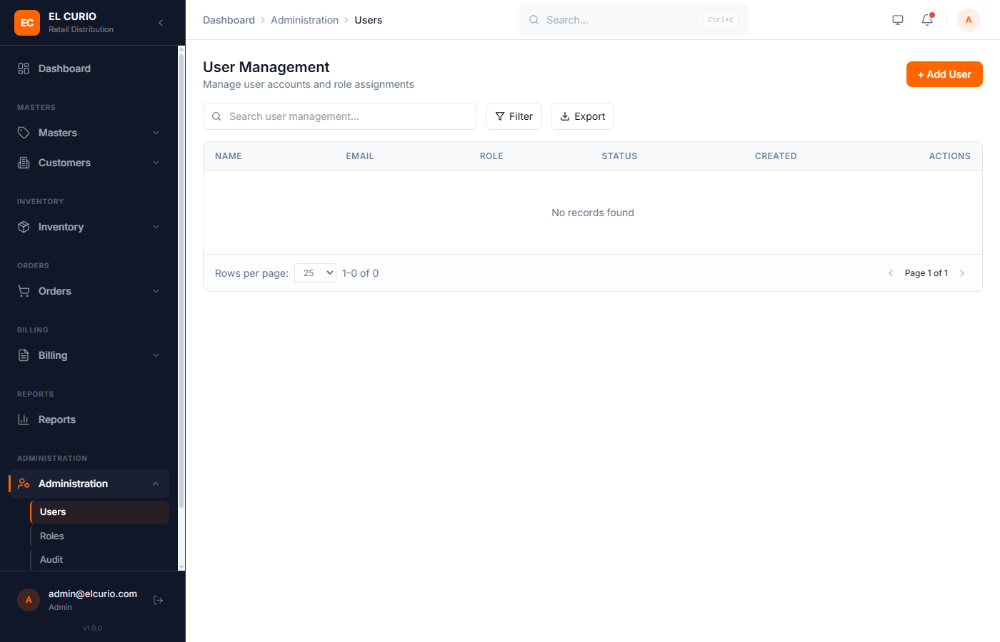

The User Management page displays all users in a table with columns for Name, Email, Role, Status, and Created date.

**How to Create a User**

1. Navigate to **Dashboard > Admin > Users**.
2. Click **"+ Add User"**.
3. Enter the user's **Full Name**.
4. Enter their **Email** (used as the login identifier).
5. Set an initial **Password** (the user should change this on first login).
6. Select a **Role** from the dropdown:
   - Admin, Manager, Warehouse, Sales, Accounts, Viewer
7. Click **Save**. The user can now log in with the provided credentials.

**User Management Operations:**
- View all users with their roles, active status, and last login timestamp.
- Edit user details (name, email, role).
- Activate or deactivate users. Deactivated users cannot log in but their historical data is preserved.
- Delete users (soft delete).

---

### 8.2 Roles and Permissions

**Path:** Dashboard > Admin > Roles
*Accessible only to Admin role.*

Manage roles and configure module-level permissions using a granular permission matrix. The system implements role-based access control (RBAC) with **34 modules** and **4 roles**, totaling **136 role-permission mappings** stored in the `auth.RolePermissions` table.

**Permission Matrix View**

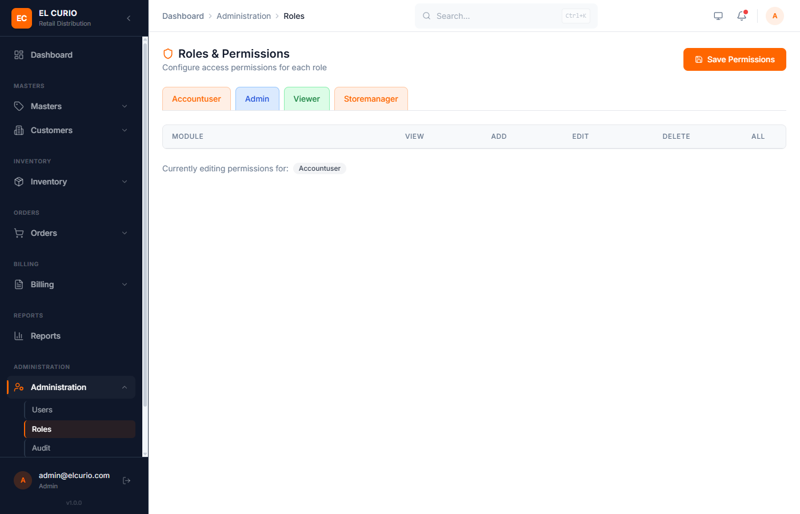

The Roles & Permissions page shows role tabs (Admin, Storemanager, Accountuser, Viewer) and a permission matrix with Module, View, Add, Edit, Delete, and All columns. Select a role tab to view and modify its permissions, then click "Save Permissions" to apply changes.

**Permission Levels (per module)**

Each module can be assigned any combination of the four permission levels:

| Code | Permission | Description |
|------|------------|-------------|
| **V** | **View** | Can see and read the data in this module |
| **A** | **Add** | Can create new records |
| **E** | **Edit** | Can modify existing records |
| **D** | **Delete** | Can remove records |

**Roles**

The system ships with 4 predefined roles:

| Role | Description | Access Summary |
|------|-------------|----------------|
| **Admin** | Full system administrator | V/A/E/D on all 34 modules including Users, Roles, Audit, CompanyMaster, and License management. |
| **Storemanager** | Operational store and warehouse management | V/A/E/D on all business operations (orders, stock, dispatch, returns, production, master data). View-only on administrative modules (Users, Roles, Audit, CompanyMaster, License). |
| **Accountuser** | Finance, billing, and inventory | V/A/E on billing, inventory, invoices, packing, delivery, stock, receipt, dispatch, returns, stock adjustment, and transactions. View-only on master data and admin modules. |
| **Viewer** | Read-only access | View-only permission on all 34 modules. Cannot create, edit, or delete any records. |

**Complete Module List (34 Modules)**

The permission matrix covers the following 34 modules, organized by functional area:

*Core:*
Dashboard

*Customer Management:*
Clients, Stores

*Warehouse:*
Warehouses

*Product Catalog:*
Articles, SKUs

*Inventory Operations:*
Stock, Receipt, Dispatch, Returns, StockAdjustment, StockFreeze, Transactions

*Billing & Documents:*
Invoices, PackingList, DeliveryNotes

*Reporting:*
Reports

*Administration:*
Users, Roles, Audit, CompanyMaster, License

*Master Data:*
Brands, Genders, Seasons, Segments, SubSegments, Categories, SubCategories, Groups, Sizes

*Orders & Production:*
CustomerOrders, ProductionOrders, SalesChannels

**Full Permission Matrix**

| # | Module | Admin | Storemanager | Accountuser | Viewer |
|---|--------|-------|--------------|-------------|--------|
| 1 | Dashboard | V/A/E/D | V/A/E/D | V/A/E | V |
| 2 | Clients | V/A/E/D | V/A/E/D | V | V |
| 3 | Stores | V/A/E/D | V/A/E/D | V | V |
| 4 | Warehouses | V/A/E/D | V/A/E/D | V | V |
| 5 | Articles | V/A/E/D | V/A/E/D | V | V |
| 6 | SKUs | V/A/E/D | V/A/E/D | V | V |
| 7 | Stock | V/A/E/D | V/A/E/D | V/A/E | V |
| 8 | Receipt | V/A/E/D | V/A/E/D | V/A/E | V |
| 9 | Dispatch | V/A/E/D | V/A/E/D | V/A/E | V |
| 10 | Returns | V/A/E/D | V/A/E/D | V/A/E | V |
| 11 | StockAdjustment | V/A/E/D | V/A/E/D | V/A/E | V |
| 12 | StockFreeze | V/A/E/D | V/A/E/D | V | V |
| 13 | Transactions | V/A/E/D | V/A/E/D | V/A/E | V |
| 14 | Invoices | V/A/E/D | V/A/E/D | V/A/E | V |
| 15 | PackingList | V/A/E/D | V/A/E/D | V/A/E | V |
| 16 | DeliveryNotes | V/A/E/D | V/A/E/D | V/A/E | V |
| 17 | Reports | V/A/E/D | V/A/E/D | V/A/E | V |
| 18 | Users | V/A/E/D | V | V | V |
| 19 | Roles | V/A/E/D | V | V | V |
| 20 | Audit | V/A/E/D | V | V | V |
| 21 | CompanyMaster | V/A/E/D | V | V | V |
| 22 | License | V/A/E/D | V | V | V |
| 23 | Brands | V/A/E/D | V/A/E/D | V | V |
| 24 | Genders | V/A/E/D | V/A/E/D | V | V |
| 25 | Seasons | V/A/E/D | V/A/E/D | V | V |
| 26 | Segments | V/A/E/D | V/A/E/D | V | V |
| 27 | SubSegments | V/A/E/D | V/A/E/D | V | V |
| 28 | Categories | V/A/E/D | V/A/E/D | V | V |
| 29 | SubCategories | V/A/E/D | V/A/E/D | V | V |
| 30 | Groups | V/A/E/D | V/A/E/D | V | V |
| 31 | Sizes | V/A/E/D | V/A/E/D | V | V |
| 32 | CustomerOrders | V/A/E/D | V/A/E/D | V | V |
| 33 | ProductionOrders | V/A/E/D | V/A/E/D | V | V |
| 34 | SalesChannels | V/A/E/D | V/A/E/D | V | V |

> **Note:** The "All" checkbox in the UI toggles all four permissions (V/A/E/D) for a module at once.

---

### 8.3 Company Master

**Path:** Dashboard > Admin > Company

Manage your company (tenant) profile. These details appear on all printed documents including invoices, packing lists, and delivery notes.

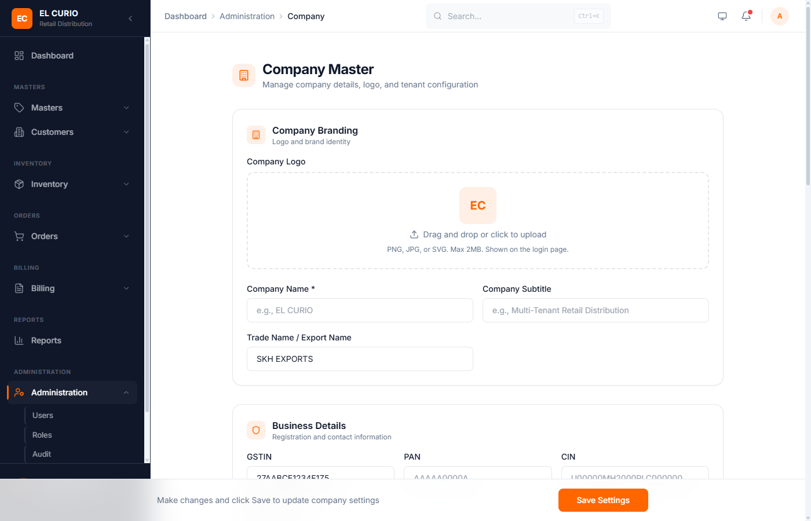

The Company Master page is organized into sections: Company Branding (logo upload, company name, subtitle, trade name), Business Details (GSTIN, PAN, CIN, address, city, state, pincode, phone, email, website), Bank Details (account name, bank, branch, account number, IFS code), Tax Configuration (GST registration type, HSN code prefix, GST rates for footwear and other goods), and Invoice Configuration (prefix, format, financial year, terms and conditions, declaration, authorised signatory).

**Fields:**

| Field | Description |
|-------|-------------|
| Company Name | Legal business name |
| Company Code | Short identifier used in document numbering |
| GSTIN | Company GST Identification Number |
| PAN | Company Permanent Account Number |
| Address | Registered office address |
| City | City |
| State | State of registration |
| PIN Code | Postal code |
| Phone | Company contact number |
| Email | Company email address |
| Logo URL | URL to the company logo image (displayed on documents) |

---

### 8.4 License Management

**Path:** Dashboard > Admin > License

View and manage your RetailERP license details.

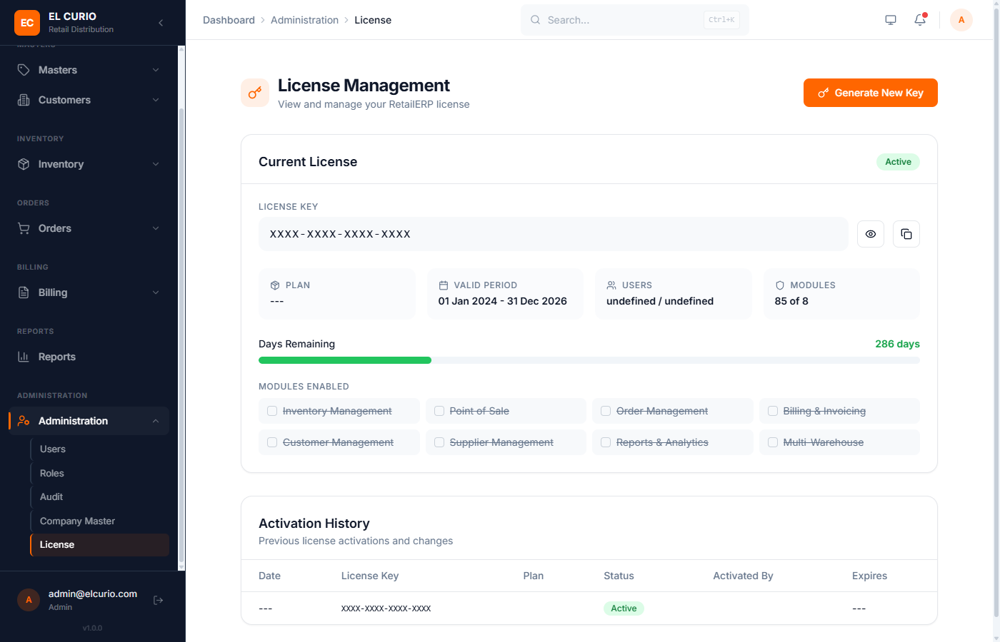

The License Management page displays the current license status, license key (masked for security with reveal/copy options), plan details, valid period, user count, module count, days remaining with a progress bar, and a list of enabled modules (Inventory Management, Point of Sale, Order Management, Billing & Invoicing, Customer Management, Supplier Management, Reports & Analytics, Multi-Warehouse). An Activation History table shows previous license changes.

**License Fields:**

| Field | Description |
|-------|-------------|
| License Status | Active, Expired, or Trial |
| Expiry Date | When the current license expires |
| Licensed Modules | Which modules are included in your license tier |
| User Count Limit | Maximum number of concurrent users allowed |
| License Key | Your unique license key (displayed partially for security) |

---

### 8.5 Audit Log

**Path:** Dashboard > Admin > Audit

View a chronological, immutable log of all system changes for compliance and accountability.

**Audit Log Fields:**

| Field | Description |
|-------|-------------|
| Timestamp | Exact date and time of the action |
| User | Name and email of the user who performed the action |
| Action | Type of operation: CREATE, UPDATE, or DELETE |
| Entity Type | Which module/table was affected (e.g., Article, Order, Invoice) |
| Entity ID | The specific record identifier |
| Old Values | The values before the change (JSON format) |
| New Values | The values after the change (JSON format) |
| IP Address | The IP address from which the action was performed |

**Common Use Cases:**
- Investigate who changed an article price or margin
- Track order status changes and who authorized them
- Review user login and logout activity
- Identify unauthorized modifications for compliance audits
- Resolve disputes about when and by whom a record was changed

---

## 9. Common Operations

These operations are available throughout the application and work consistently across all modules.

---

### 9.1 Search

**Global Search (Ctrl+K)**

Press **Ctrl+K** (or **Cmd+K** on Mac) from anywhere in the application to open the global search palette. This is the fastest way to find any record:

1. Press **Ctrl+K**. The search overlay appears.
2. Start typing your search query (e.g., article code, client name, order number).
3. Results appear in real-time, grouped by module (Articles, Clients, Orders, Invoices, etc.).
4. Use the **arrow keys** to navigate results and **Enter** to open the selected result.
5. Press **Escape** to close the search palette.

**Module-Level Search**

Every list page has a search bar at the top. Type to filter the current list by the primary fields of that module:

- **Brands** -- Searches by brand name
- **Articles** -- Searches by article code and article name
- **Clients** -- Searches by client name, code, or organisation
- **Orders** -- Searches by order number or client name
- **Invoices** -- Searches by invoice number or client name

### 9.2 Filter

Most list pages provide filter controls above the data table. Filters vary by module but common patterns include:

- **Dropdown filters** -- Select from a predefined list (e.g., Brand, Category, Status)
- **Date range filters** -- Pick a start and end date
- **Toggle filters** -- ON/OFF switches (e.g., "Active Only", "Low Stock Only")
- **Multi-select filters** -- Select multiple values (hold Ctrl/Cmd to select more than one)

Filters are applied immediately. To reset, click the **Clear Filters** button or remove individual filter selections.

### 9.3 Export

All data tables and reports support CSV export:

1. Apply any desired filters to the data.
2. Click the **Download** or **Export CSV** button (typically in the top-right area of the page).
3. The browser downloads a CSV file named with the module and current date.
4. Open the CSV in Microsoft Excel, Google Sheets, or any spreadsheet application.

### 9.4 Pagination

Large data sets are displayed in paginated tables:

- The default page size is **10 rows** per page.
- Use the page size selector to change to 10, 25, 50, or 100 rows per page.
- Navigate between pages using the **Previous** / **Next** buttons or click specific page numbers.
- The total record count is displayed (e.g., "Showing 1-10 of 247 records").

### 9.5 Keyboard Shortcuts

| Shortcut | Action |
|----------|--------|
| **Ctrl+K** / **Cmd+K** | Open global search palette |
| **Escape** | Close modal dialogs and search palette |
| **Enter** | Confirm/submit the active form or dialog |
| **Tab** | Move to the next form field |
| **Shift+Tab** | Move to the previous form field |

### 9.6 Theme and Customization

**Changing Theme Mode**

Click the theme switcher in the header to toggle between:
- **Light Mode** -- Bright background with dark text
- **Dark Mode** -- Dark background with light text
- **System** -- Automatically follows your operating system preference

**Changing Accent Color**

The application supports 5 accent color themes:

| Theme | Color |
|-------|-------|
| Blue | Standard blue |
| Indigo | Deep purple-blue |
| Emerald | Green |
| Purple | Violet |
| Orange | Warm orange (default) |

Theme and color preferences are saved in your browser and persist across sessions.

---

## 10. Frequently Asked Questions

### General

**Q: I forgot my password. How do I reset it?**
A: Contact your system administrator. They can reset your password from the Admin > Users page. There is no self-service password reset at this time.

**Q: Can I change my own password?**
A: Yes. The system supports password changes through your user profile or via the API endpoint `/api/auth/change-password`. Contact your admin if you need assistance.

**Q: I am getting "Unauthorized" errors on pages I should have access to.**
A: Your session may have expired. Log out and log in again. If the issue persists, ask your administrator to verify your role permissions in Admin > Roles.

**Q: Can multiple people use the system at the same time?**
A: Yes. RetailERP supports concurrent users. Each user session is independent, and all changes are saved to the central database in real-time.

**Q: What browsers are supported?**
A: RetailERP works best on modern browsers: Google Chrome (recommended), Mozilla Firefox, Microsoft Edge, and Safari. Internet Explorer is not supported.

### Master Data

**Q: I cannot delete a brand (or gender, category, etc.). Why?**
A: Master records that are referenced by other records (articles, orders, invoices) cannot be deleted to maintain data integrity. You must first remove or reassign all dependent records. Alternatively, set the record's Active status to OFF to hide it from dropdowns without deleting it.

**Q: What is the difference between a Segment and a Category?**
A: **Segment** represents the product line or business division (e.g., Footwear, Leather Goods). **Category** represents the physical product type (e.g., Shoes, Bags, Belts). An article belongs to both -- for example, a Derby shoe is in the "Footwear" segment and the "Shoes" category.

**Q: What is an HSN Code?**
A: Harmonized System of Nomenclature -- a standardized classification code used by the Indian government for GST tax rate determination. Footwear typically uses codes starting with 64xx and attracts 18% GST.

**Q: What is CBD (Cost Breakdown)?**
A: The internal cost of manufacturing or procuring an article. It is used for margin calculations, profitability analysis, and production costing. CBD is not visible to customers.

**Q: In what order should I set up master data?**
A: Follow this sequence: (1) Brands, (2) Genders, (3) Seasons, (4) Segments, (5) Sub Segments, (6) Categories, (7) Sub Categories, (8) Groups, (9) Sizes, (10) Articles, (11) SKUs. Each step may depend on the previous ones.

### Inventory

**Q: What does "Frozen" stock mean?**
A: Frozen stock has been locked for period-end closing. No transactions (receipt, dispatch, return, or adjustment) can be posted against frozen stock until it is unfrozen by an Admin or Manager. This ensures data integrity for financial reporting.

**Q: Why can I not dispatch more than the available quantity?**
A: The system enforces real-time stock availability checks. You cannot dispatch more goods than are physically available in the warehouse. If you need to dispatch more, first record a stock receipt or adjustment.

**Q: What is the difference between Receipt and Dispatch?**
A: **Receipt (GRN)** records goods coming INTO the warehouse (inward movement). **Dispatch** records goods going OUT of the warehouse (outward movement).

**Q: How does the monthly stock ledger work?**
A: The stock ledger tracks: Opening Stock + All Inward Movements (Receipt, Production, Returns, Adjustment Add) - All Outward Movements (Dispatch, Supplier Returns, Adjustment Remove) = Closing Stock. When stock is frozen at month-end, the Closing Stock becomes the next month's Opening Stock.

### Orders and Billing

**Q: Can I edit a confirmed order?**
A: No. Once an order is confirmed, it is locked to preserve stock reservations and audit integrity. To make changes, cancel the confirmed order (with a reason) and create a new one.

**Q: How does the system calculate GST?**
A: Based on the Place of Supply (buyer's state) compared to the seller's state:
- **Same state (intra-state):** CGST (9%) + SGST (9%) = 18% total
- **Different states (inter-state):** IGST (18%)

The rate is determined by the HSN code. The default rate for footwear and leather goods (HSN 64xx) is 18%.

**Q: What is the difference between TAX_INVOICE and CREDIT_NOTE?**
A: A **Tax Invoice** is the standard sales invoice issued when goods are sold. A **Credit Note** is issued when goods are returned or prices are adjusted downward after invoicing, effectively reducing the amount the customer owes.

**Q: What is an E-Way Bill?**
A: An electronic waybill required by the Indian government for transporting goods worth more than Rs. 50,000. The E-Way Bill number can be entered on the invoice for compliance.

**Q: What is the difference between "NET OF TAXES" and "ON MRP" margin types?**
A: With **"ON MRP"** margin, the discount is calculated directly on the MRP. With **"NET OF TAXES"** margin, the discount is calculated on the MRP excluding the tax component, resulting in a slightly different unit price. Your client agreement determines which method to use.

### Reports

**Q: Can I export reports to Excel?**
A: Reports can be exported as CSV files by clicking the Download/Export button. CSV files open natively in Microsoft Excel and Google Sheets.

**Q: How often is report data refreshed?**
A: Reports query live data from the database. Every time you load or refresh a report page, you see the most current data. There is no caching delay.

**Q: Can I schedule automatic report generation?**
A: Scheduled reports are not currently available in the UI. Contact your administrator about setting up automated report generation via the API.

### Administration

**Q: What happens when I deactivate a user?**
A: Deactivated users cannot log in. Their active sessions (if any) are terminated. All historical data created by that user (orders, invoices, audit entries) is preserved unchanged.

**Q: Can I create custom roles beyond the default six?**
A: The six default roles (Admin, Manager, Warehouse, Sales, Accounts, Viewer) cover most scenarios. While you cannot create entirely new roles through the UI, you can customize the permissions within each existing role via the Roles and Permissions page.

**Q: How do I back up the system data?**
A: RetailERP uses a database backend. Contact your system administrator or IT team to configure regular database backups. The application does not provide a built-in backup UI.

**Q: Is there a mobile app?**
A: RetailERP is a responsive web application that works on mobile browsers. There is no separate native mobile app. For the best mobile experience, use Chrome or Safari and add the application to your home screen.

---

## 11. Documentation Portal

RetailERP includes a dedicated documentation portal accessible at **http://localhost:3100** (or the documentation URL provided by your administrator). The portal provides a modern, searchable interface for browsing all project documentation.

**Portal Features:**

- **User Manual** -- This complete user guide, formatted for easy reading with navigation and search
- **API Reference** -- Technical API documentation for developers integrating with RetailERP
- **Architecture Documentation** -- System design, database schemas, and deployment guides
- **Full-Text Search** -- Search across all documentation from a single search bar

To access the documentation portal, open your browser and navigate to the documentation URL. No login is required -- the documentation portal is publicly accessible on your network.

---

*This manual covers RetailERP v2.1. For technical documentation, API reference, and deployment guides, refer to the documentation portal at http://localhost:3100 or the developer documentation in the `docs/` folder.*
