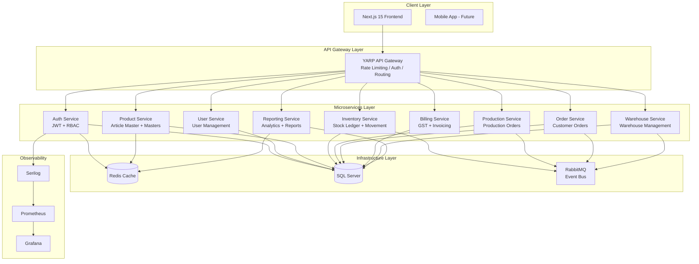
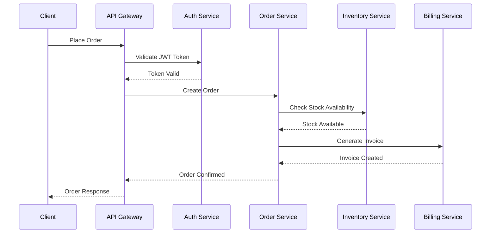
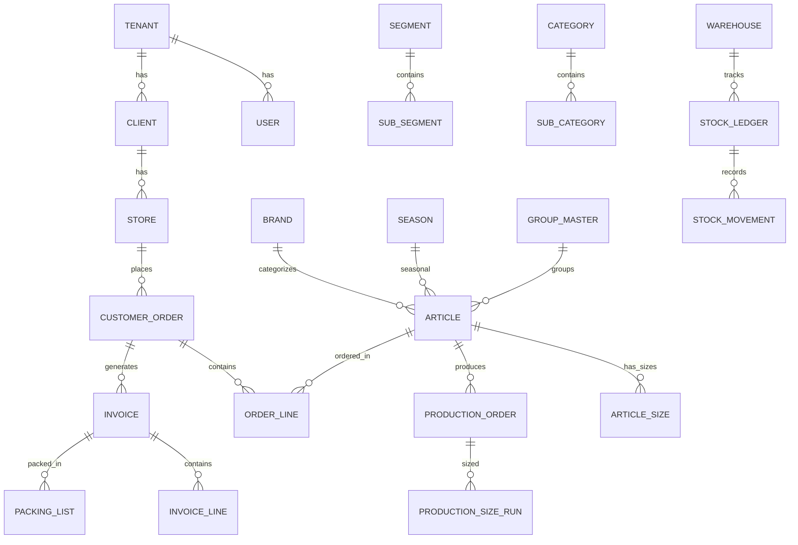

# RetailERP - Enterprise Architecture Document

## System Overview

**EL CURIO RetailERP** is a multi-tenant retail distribution platform for footwear, bags, and belts manufacturing and distribution. It manages inventory, billing, analytics, and warehouse operations from a single platform.

## Architecture Diagram



## Service Communication



## Database Schema Overview



## Clean Architecture per Service

```
Service/
├── Domain/                    # Enterprise Business Rules
│   ├── Entities/
│   ├── ValueObjects/
│   ├── Enums/
│   └── Interfaces/
├── Application/               # Application Business Rules
│   ├── DTOs/
│   ├── Interfaces/
│   ├── Services/
│   ├── Validators/
│   └── Mappings/
├── Infrastructure/            # Frameworks & Drivers
│   ├── Data/
│   │   ├── Context/
│   │   ├── Repositories/
│   │   └── Configurations/
│   ├── Services/
│   └── Caching/
└── API/                       # Interface Adapters
    ├── Controllers/
    ├── Middleware/
    ├── Filters/
    └── Extensions/
```

## Technology Decisions

| Component | Technology | Rationale |
|-----------|-----------|-----------|
| Frontend | Next.js 15 + ShadCN | SSR, App Router, enterprise UI components |
| Backend | ASP.NET Core 8 | Performance, enterprise support, ecosystem |
| Database | SQL Server | ACID compliance, stored procs, enterprise features |
| Cache | Redis | Distributed cache for multi-instance deployment |
| Gateway | YARP | .NET native reverse proxy, high performance |
| Auth | JWT + RBAC | Stateless auth, fine-grained permissions |
| Messaging | RabbitMQ | Async inter-service communication |
| Containers | Docker + K8s | Orchestration, scaling, self-healing |
| CI/CD | GitHub Actions | Native GitHub integration |
| Logging | Serilog | Structured logging, multiple sinks |
| Metrics | Prometheus + Grafana | Industry standard observability |

## Security Architecture

- JWT tokens with refresh token rotation
- RBAC with permission matrix (Admin, Manager, Warehouse, Sales, Accounts)
- API rate limiting per tenant
- Input validation at all boundaries
- SQL injection prevention via parameterized queries
- Audit logging for all mutations
- HTTPS everywhere
- CORS restricted to known origins
